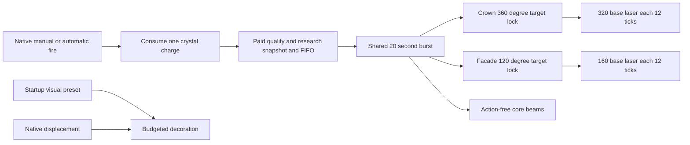

# ANISETRON — Processional Cathedral

## Implementation sources

- [vehicle, weapons and progression](../../../exotic-space-industries-remembrance/prototypes/alien-system/anisetron.lua)
- [paid weapon configuration](../../../exotic-space-industries-remembrance/lib/anisetron-config.lua)
- [reference 17 framing and anchors](../../../exotic-space-industries-remembrance/lib/anisetron-graphics.lua)
- [visual fidelity presets](../../../exotic-space-industries-remembrance/lib/anisetron-visual-config.lua)
- [paid burst controller](../../../exotic-space-industries-remembrance/scripts/control/anisetron.lua)
- [Lance inheritance and committed pulses](../../../exotic-space-industries-remembrance/scripts/control/anisetron-lance.lua)
- [movement and weapon decoration](../../../exotic-space-industries-remembrance/scripts/control/anisetron-visuals.lua)
- [native slowing safeguard](../../../exotic-space-industries-remembrance/scripts/control/anisetron-mobility.lua)
- [slowing safeguard configuration](../../../exotic-space-industries-remembrance/lib/anisetron-mobility-config.lua)
- [late prerequisites, baseline Lance graphics and stat readouts](../../../exotic-space-industries-remembrance/scripts/data-final-updates/anisetron.lua)

## Ownership and behavior

ANISETRON is a standalone native Spidertron derived from the Gaian saucer,
outside the researched replacement families. Reference 17 retains the generated
chapel's original geometry, proportions, UVs and PBR textures. Its exposed upper
crystal supplies the crown beam; its original facade crystal supplies the frontal
beam. Native movement, remote/autopilot, equipment, inventories, manual controls
and ammunition logistics remain engine-owned.

## Guarded mandatory service

The central `control.lua` updater calls `has_tick_work(event)` and then
`updater(event)` at its tail, after Hemocrystal walls and beyond `::skip::`.
This preserves the former outer on-tick tail position across all sixteen slots.
Service order remains mobility, movement visuals, committed Lance effects, then
each paid owner's contacts and presentation. No new scheduler slot is introduced.

The read-only event predicate combines clock-only child predicates. Nonempty
paid-owner membership includes queued work and owners awaiting cleanup. Mobility
uses its retained count and due minimum, including healthy parked vehicles.
Visuals admit revision repair or a missing module-local preset, attached handles,
transient cleanup, or enabled due sampling with queued membership. Lance effects
admit live Wound marks or due committed packets even after source removal;
permanent upgrade memories and future packets alone do not keep service active.
Predicates never create storage, count queues, query entities or build snapshots.

Existing child guards still decide actual service and cadence. Normal service
initializes the local visual preset after load; the predicate never mutates it.
Off cleanup remains admitted for old revisions and live handles. An idle empty
visual registry no longer refreshes its diagnostic `last_pass` on every cadence
tick; it records the last actual service. This does not change fleet visitation,
effect expiry, paid deadlines or native movement.

The [dispatch fixture](../../../scripts/qc/anisetron-dispatch/README.md) covers
all scheduler phases, a real `goto skip`, repeated pure predicate probes and a
shared-target Lance/cathedral order comparison. Frozen/current profiling uses a
fixed simulated-tick denominator; skipped idle calls are expected.

## Payment, targeting and migration

The private category mirrors the Lance's final ammo-damage modifiers from
`laser-weapons-damage-6` and infinite `laser-weapons-damage-7`. Tiers 1–5
do not change base damage; there is no custom upgrade chain or gun-speed bonus. A native shot
consumes one single-round crystal charge, with a 1200-tick cooldown and 85-tile
base acquisition range. Native vehicle quality scales the crown range; native and
scripted crown eligibility use bounding-box separation. The facade retains its
30-tile center-distance limit and 120-degree arc. Its invisible one-tick beam has only the paid script effect.
`control.lua` routes that effect exclusively and forwards the supplied tick to
the ANISETRON owner. Core beams have no damage action.

`storage.ei.runtime_scheduler.modules.anisetron.active` owns paid FIFO queues and
active bursts. New admissions carry `contract_version = 3`, quality, duration,
force/surface identity, contact interval, separate ranges, independent crown/facade
damage and all four Lance capability/coefficient snapshots. At payment,
`max(0, 1 + force.get_ammo_damage_modifier(category))` multiplies both allocations
alongside ammo quality. Research during a paid burst affects only later payments.
The native
opening target is retained as a validated facade acquisition preference.

Normal bursts occupy [start,start+1200), with contacts at 0,12,...,1188. Crown
contacts deal 320 base laser and facade contacts 160: at most 100 per channel, 2400
combined base DPS and 48000 combined damage before research and resistances. Unused channel damage
is neither transferred nor banked. Ammo quality scales both allocations; vehicle
quality does not substitute for it. The duration-quality hook defaults to zero.

One bounded military-target query per contact provides both channels. The crown
holds a valid enemy in any direction. The facade holds a valid enemy in the
current torso's +/-60 degree arc. On invalidation each selects the nearest
eligible enemy with unit-number ties; native opening targets have first preference.
Crown damage precedes facade damage, with fresh eligibility before each packet.
Both channels may contact the same target. An unwrapped angular waypoint retains
the previous endpoint through replacement acquisition, including north wrap and
moving targets. Smoothstep reserves 8–60 ticks with a six-degree-per-tick cap;
the facade is additionally clamped inside its moving torso arc. Fast torso turns
can move that boundary faster than the acquisition cap. Large bearing changes
of the same target reacquire smoothly. Ordinary movement tracks the held target.
Scheduled contacts during acquisition are spent without damage: no delayed
packets, extended deadlines or damage to visually crossed enemies. Lethal contact
copies its world tip before damage and remains visible for up to 12 ticks within
the paid deadline. Loss without a lethal packet briefly retains the last aim.

Both sides of friendship/cease-fire, validity, health, range and surface are
checked. Missing targets consume paid time. Empty ammo or released manual input
does not cancel an already-paid burst. Source removal or force/surface reassignment
cancels the active burst and queued work without refund. Retriggers queue instead
of replacing paid records, including durations longer than the native cooldown.
At expiry, one already-paid twin-channel record may start on the same tick, keeping
successive contracts contiguous. Adjacent v2/v3 contracts carry their locks and
interpolation into the new payment instead of arbitrarily changing enemies.
A queued historical record keeps its original
one-tick handoff. A bounded two-attempt service cannot drain arbitrary queues.

Missing contract versions identify historical facade-only bursts. They retain
their saved 240*quality damage, original frontal ping-pong, duration, contact
deadlines and FIFO order. Rebuilds may replace visual handles but never reset
payment, times or queues, and never grant those records a free crown channel.
Old active v2 records lazily adopt angular fields without resetting paid work.
The damage increase does not reprice old active or queued v2 records: their saved
160/80-quality or later 320/160 allocations remain authoritative. Version-two
records retain 30-tile ranges and no inherited payload. Version dispatch explicitly
recognizes 2 and 3 as twin contracts; absent/version-one records remain historical.
Save/load resumes serialized work without on-load mutation.

## Crown Lance inheritance

The recipe consumes one base Singularity Lance in addition to its existing
ingredients, and initial/late technology prerequisites retain the base Lance and
Laser weapons damage 5. Upgrade technologies are capabilities, not construction
gates. Existing computer-age science propagation remains authoritative.

The reusable [packet helper](../../../exotic-space-industries-remembrance/lib/singularity-lance-payload.lua)
owns hostile packet validation, incision selection/deduplication, primary Wound
resolution and collapse packet construction. The [art factory](../../../exotic-space-industries-remembrance/lib/singularity-lance-art.lua)
owns pure baseline/upgrade materials. Neither helper owns payment, persistent
state, events or deadlines. The Lance turret keeps its original controller and
baseline splash; an unupgraded cathedral crown remains single-target.

At payment the crown snapshots the Lance capability level, all geometry, damage
coefficients and the cathedral's ammo-quality/research multiplier. Secondary
coefficients scale by 320/500. Axial adds 320 central or 160 branch damage with the
Lance's caps and geometry. Wound deals 320,384,448,512,576,640 on the first six
successful normal contacts, expiring after 120 ticks or a target change.
Collapse commits at contact+30: 640 core or 384 outer. Every eighth scheduled
opportunity empowers the Wound-adjusted primary by four, expands incision caps,
commits 1280/768 collapse and a 640 echo at contact+60. Wound/Testament primary
multipliers never inflate secondary packets. Quality and ANISETRON research
multiply each packet once; ordinary Lance baseline splash is excluded.

`storage.ei.runtime_scheduler.modules.anisetron.lance` owns live per-vehicle
Wound context and reserved Testament phase, marks and committed delayed buckets.
A paid charge reserves all its scheduled opportunities across charges, including
misses. No empowered opportunity is banked for a later hit. Brief idle/resupply
preserves an unexpired same-target Wound; target changes and diplomacy clear it.
Research loss detaches live context while already-paid snapshots finish unchanged.
Mining, removal, ownership and surface changes reset live weapon memory.
Force merges remap committed packet attribution; deleted surfaces cancel packets.

A landed crown contact freezes its world position and incision geometry, then
commits collapse/echo before synchronous damage callbacks. Those pulses survive
source removal and use current target positions and diplomacy at their fixed
deadlines. Removal still cancels unperformed burst contacts and queues. All timing
uses the existing central tick/research/force/surface routes and shared scheduler.
Rebuilds replace finite cues without changing paid queues or packet deadlines.

## Art and native pose

Reference 17 uses 128 static 512-square directions for body, shadow, glow and
neutral owner mask, with two 4096-square 8x8 files per pass. Direction zero is
north/rear; 32 east; 64 south/facade; 96 west. All layers disable angle reprojection
and share the generated scale and zero shift. Original gold/dark colors remain
baked; a small facade crest alone receives owner color. Crystal emission is a
separate controlled pass. The unlifted body receives native height 1.8 once;
separate shadow casters alone are raised during rendering.

The asset manifest generates exact 128-entry projected tables for crown, facade
and eight original lower crystal tips through the locked camera. The original
three entries are retained and five side/rear entries appended. Root visibility
is exported per heading by tracing the original hull geometry. Core beams use native
entity sources and those offsets. Consecutive full native torso steps are led
once for rendering because physics follows on_tick; gameplay uses actual torso.
Stationary, inactive, clipped or discontinuous samples receive no lead. An abrupt
unexposed native turn-goal change can still produce a one-tick boundary ambiguity.
The same pose lookup updates live decorations. Script-rendered offsets require
separate engine height/bob calibration. Engine markers show entity render targets
receive base hover height, while the current torso bob is not exposed. Decorations
use no additional speed-derived lift. Native bob speed 1 replaces .08: sampled
cruise excursion falls from 41 pixels to 3-4 pixels at normal zoom. The remaining
script-root/body difference is about -1.8 to +2.3 pixels in the reviewed views.
Native beam sources retain their real entity-height transform. Neither a fixed
cruise correction nor the former speed curve can represent the native bob phase.

Both beams share the Lance artwork factories. Crown scale 1.2 and facade scale .6
establish a two-to-one visual thickness. Crown axial/Testament materials, incision
extensions, Wound marks and fixed collapse/echo cues use ANISETRON-owned prototypes
and its own fidelity inputs. The facade retains the baseline material. Each channel samples a saved private cosmetic RNG for one
of the Lance's six baseline chromatic light variants. Emissive ribbons and white
core retain their artwork; endpoint lights and first/subsequent contact flashes
share the palette index. The separate ground-projected ray is empty: its glow
separated from the elevated crystal ray. Additive artwork remains in the same
animation layers and transform as the core. Heading-driven core replacement,
contiguous paid handoff and reload retain that index rather than flickering.
Sprite shifts and dimensions scale together. Spatial start/ending artwork is
retained, restoring the crystal flare and impact cap, with transparent endpoint
animations disabled. The redundant scripted source halo is removed; the native
flare shares the beam's true source transform. Native legs, friction, torso rotation and restrained
bobbing remain the movement authority; their calibrated topology is below.
The saucer's original hover sample supplies a lower native hum: moving playback
range .78-.82, idle .72-.76, a gentler activity pitch ramp and 20/60-tick fades.
Audio follows native movement/idle behavior independently of visual fidelity.
Each eligible firing channel also owns an invisible native entity with working
sound playing a seamless loop derived from the Lance's CC0 samples. A quieter,
higher facade voice sits under the crown. Visible core recreation through turns
does not restart the sound. Missing targets, paid expiry, source removal and
visual rebuilds destroy those helpers; paid-state ownership governs their
deadline. Configuration rebuild also clears exact orphan voice types once.
Build and clone routing removes ownerless copied voice helpers before the native
Spidertron replacement-transaction guard; it leaves the original paid voice intact.
Fidelity does not govern audio.

## Startup fidelity and movement effects

`ei-anisetron-visual-fidelity` defaults to standard and offers off, lean,
standard, cinematic, maximal and unbounded. The visual config alone owns these
presets; no mechanical branch reads them. All 128 body directions and both core
beams and essential incision/collapse/echo cues remain at every tier. Only
filaments and optional glow, halos, lights and contact flashes scale.

The module's `visuals` state is separate from `active` paid work. Exact build,
clone and committed removal hooks register unit numbers. Initialization and
configuration changes discover exact cathedral entities once, clear derived
rendering and reset displacement baselines. Rebuilds preserve all paid state.

Eight thin green animations attach to the original front, side and rear keel tips,
with a .7–1.4-tile length curve. A heading-dependent visibility mask hides roots
occluded by the architecture. A 32-direction screen-plane clearance table also
suppresses a whole filament if its full length would cross the hull. It samples
the original mesh every .1 tile with .05-tile lateral clearance; both neighboring
direction bins must pass. Native animation orientation and the lookup both use
clockwise screen-space angles. A downward fall plus a smaller opposite-travel
component prevents northward trails from pointing through the hull. The sprite
has zero shift; its center is explicitly placed half its scaled length beyond
the crystal root. Prototype shift did not scale with runtime x_scale and placed
old strands partly inside the hull. All eight tips remain in the handle set. Actual displacement
divided by elapsed ticks admits motion at .01 tile/tick and stops at .005. Native
unmanned/autopilot movement is included; idle fire, torso rotation and bobbing do
not admit strands. Handles have a renewed 12-tick safety TTL. Movement motes and
their cadence/counters are removed; teleport/surface changes reset baselines.
Live attached strands renew that safety TTL each tick between bounded fleet
visits. Their separately cached `applied_index/angle/length/lift` describe only
the geometry last written to owned render handles. Native entity targets follow
translation; unchanged geometry needs no repeated target/visibility assignment.
Pose prediction and validity/TTL service still run every tick. Creation supplies
complete geometry, clearing handles resets the cache, and absent old-save fields
force an update. The shared movement light follows the same geometry decision.
Finite contact effects compact in place without changing order or expiry, and
endpoint lights keep their startup intensity and saved palette between updates.
Raised teleport events immediately clear movement handles and reset the
position/time/pose sample without touching paid queues. Surface changes and large
unraised discontinuities are also rejected during movement sampling.
Movement effects use the light-effect layer so the air-object hull cannot hide
the visible filaments. A visual revision rebuild replaces old attached handles
without replacing paid state. One small light is centered beneath the whole base;
this attached light keeps the scripted strands readable in Factorio 2.0
night lighting. It reuses a finite 12-tick handle, shares the weapon-decoration
creation budget, and clears with the strands on stopping, removal or Off.

Movement service intervals are 8/4/3/2/1 ticks for enabled tiers, with distinct
vehicle caps 8/32/64/128/unlimited. Strand creations are capped at the exported
attachment count times that limit: 64/256/512/1024/unlimited. Weapon decoration creation caps per tick are
8/32/64/128/unlimited, including separate light handles. Halo alphas are
.25/.40/.50/.60/.70; contact flash TTLs are 4/6/8/10/12 ticks.

Service snapshots starting unique queue membership before requeueing. Even
unbounded visits each starting ID once and terminates. Excess visual work is
dropped, not banked. Off destroys decoration and performs no movement tracking;
zero TTL must never be sent to rendering, where it means permanent. LuaRenderObject
handles use `.valid` directly; entity safety remains `ei_lib`-owned.

## Native hover and ten-anchor trial

The shipping prototype retains four invisible, collision-free native legs in
two groups. The ten-anchor trial uses interleaved pentagons fitted to the original
mount and ground bounds, .02/.02 response and measured per-leg stretch force .2.
This is empirical calibration, not assumed normalization by leg count. Native
overlap zero produced the best useful gait: .5/.75 surged, and .05 added reversal
hesitation. The retained helper applies ten legs only in staged QC.

The [gait fixture](../../../scripts/qc/anisetron-glide/README.md) compares the
original four-anchor control, saucer and native ten-anchor candidates. The
eight-heading, naked/equipped qualification measures 52.2-53.6% of saucer cruise
and approximately 28% less average normalized cruise variation. Native height
1.8, historical bob speed .08, torso turning .005, friction and the then-current
slowing safeguard were unchanged in that trial. No runtime position/speed override supplies propulsion.

The measured tradeoff is modest additional native coasting: mean braking distance
4.422 to 4.779 tiles (maximum paired increase .711), with full settlement averaging
5.69 ticks later. Restart reaches 90% cruise 2-5 ticks later. Reversals spend fewer
ticks stationary; the 90-degree peak quantized velocity step is slightly larger.
These results support smoother cruise, not a claim that every transient improves.
The fixture's verification report records phase-specific metrics and evidence limits.

The ten-leg candidate is not promoted. Fresh body registration and engine pixels
show native heave changing about .87 tile at effectively equal eastbound speed.
The speed-only decorative lift cannot follow that motion, leaving crystal strands
28-38 normal-zoom pixels above the body. Native core anchoring substantially follows
the real height; decorative strands/halos require a different height carrier.
The approved promotion gate therefore retains the four-anchor shipping gait and
its inherited force and four legs. The later stability correction uses native
bob speed 1 and zero decorative lift; the rejected trial remains historical.
Additional ten-leg, overlap, step-size, friction and fast-leg trials did not
remove the reproduced slowed reversal stall and are not promoted.

## Compounded slowing and native movement

Mixed enemy stickers can multiply the native Spidertron speed modifier until
the hidden legs cannot advance at Factorio's position precision. The safeguard
leaves the calibrated leg response, friction and unslowed propulsion untouched.
An ANISETRON-only native
compensation sticker raises a positive aggregate modifier below .50 into the
.50–.625 interval using 64 1.25-spaced factors. The former .20 floor still allowed
multi-second native reversal stops; .50 passed the 40-case long-travel regression.
The expanded range covers the installed
fifteen-type worst stack (tier 51); it does not claim immunity to arbitrary modded
zero multipliers or hard caps. This is a native modifier floor,
not a scripted tiles-per-tick clamp: stance changes and turns still vary speed.
Explicit zero-modifier stuns and speed caps retain native authority.

`storage.ei.runtime_scheduler.modules.anisetron.mobility` owns an exact vehicle registry
and shared-scheduler delayed cohorts independently of visual fidelity and paid
bursts. The existing central damage route admits the exact cathedral for the
next tick, allowing native hit actions to finish attaching stickers. Exact build
and teleport hooks also admit it. Healthy records remain registered and are
checked every four ticks: native sticker attachment has no event and need not
deal damage. A damage event advances a later scheduled service to the next tick;
stale delayed tickets cannot service the same record twice. Empty registries
take the existing constant-time return. Normal service takes its known earliest
bucket directly; an overdue call retains ordered catch-up through all due
buckets. The final earliest-deadline scan remains necessary because urgent
damage admission leaves earlier stale tickets among future buckets. This
changes neither service cadence nor per-record deduplication.
Init/configuration rebuild discovers exact cathedrals once,
clears only owned compensation and registers healthy as well as slowed vehicles.
Removal retires ownership. Serialized cohorts resume on load.

One invisible native sticker per compensated craft has a renewed 12-tick safety
lifetime. Its factor is divided out of the aggregate before deciding the next
tier; removing/expiring original slows retires compensation instead of granting
a speed boost. Original enemy stickers, their lifetimes and damage are never
removed or changed. No movement commands, teleport correction, equipment,
quality, ammunition or paid deadline is modified.

The intermittent no-sticker manual-input report in the user's ASS save is a
separate unresolved reproduction boundary. A 12,000-tick held-input fixture with
the installed mod set did not reproduce it. The optional QC observer records
actual player input without writing it; passing synthetic movement does not
prove that live-input report resolved. Current evidence is in
[the stability verification](../../../scripts/qc/anisetron-stability/verification.md).

## Progression and lifecycle

Both disabled recipes unlock through `ei-anisetron`. Assembly takes 120 seconds
at gravity 15.5 and consumes one empty saucer, one Singularity Lance and the agreed crystal, plating,
computer, resin and magnet inputs. The 10-second charge recipe works anywhere.
Nine direct prerequisites, including the base Lance and Laser weapons damage 5, are restored after
flattening and also declared before science propagation; native ESIR pricing
and science propagation retain ownership, without Quantum/Exotic gates.

Assembly creates a fresh item; it does not transfer a configured saucer. Native
mining/rebuilding retains equipment and vehicle metadata. Cargo and ammo are
accounted across returned inventories rather than required inside the mined item.
Remote, logistics, equipment ghosts, quality and save/load use native mechanisms.

## Evidence and replay

The focused wrapper stages the actual pack, a copied player seed, unbonused force,
resistance-free targets, real robots and a fixture-only runtime bridge. Fidelity
matrix runs compare native payment and damage across all six settings. Legacy
replay must include an actually paid historical or converted queued record.

Current reports distinguish source checks, Blender preparation, native runtime,
graphics alignment and final-data evidence. Historical reference 16 results do
not validate reference 17. No multiplayer, universal-flight or whole-factory UPS
claim follows from focused fixtures. Durable art replay and validation sources
remain alongside ignored prepared scenes, raw frames and engine captures.
The [hover/research regression](../../../scripts/qc/anisetron-hover-combat/README.md)
adds silent sticker stacks, native laser research, an old-category migration seed
and random chromatic day/night captures. Reports distinguish original 160/80
paid contracts from the new 320/160 admissions.

The [Lance inheritance verification](../../../scripts/qc/anisetron-inheritance/verification.md)
records current v3/legacy replay, all-fidelity accounting, final-data/assets,
eight-tip capture review and QC cleanup. It also records a native automatic
acquisition limitation at oversized diagonal target boundaries; manual native
fire and paid scripted eligibility agree. See the focused follow-up in
[revisit notes](../REVISIT_NOTES.md).
