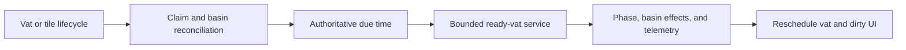

# Auric inoculation vat basin lifecycle

## Implementation sources

The pure is_terrain_claimed(surface_index,x,y) probe exposes existing basin
claims to the ecology guard without creating state or changing vat lifecycle.

- [auric-inoculation-vat.lua](../../../exotic-space-industries-remembrance/scripts/control/auric-inoculation-vat.lua)

## Ownership and reference flow

`storage.ei.auric_inoculation_vat` owns vat records, per-surface indices, tile claims, telemetry proxies and destruction registrations, authoritative due times, ready work, GUI deadlines, and placement-guide caches. Basin eligibility and phase transitions share one record.

## Tick flow and invariants

The top-level dispatcher supplies one event and budget to `updater`; the module chooses simulation/UI work. `now_tick` keeps event/numeric ticks authoritative with a utility fallback. Delayed bucket entries are hints: `due_tick_by_unit` determines whether a popped record is truly due. Attempted work, including stale entries, consumes the bounded loop allowance. Keep vat deadlines separate from per-player UI deadlines.

## Lifecycle and cleanup

Phases, including enriched fermentation, drainage, bloom, and rest, reconcile actual machine state before advancing. Tile changes refresh relevant claims and placement regions. Entity/object destruction removes claims, proxies, pending work, and sessions; surface deletion also tears down guides and surface ownership. Cursor, position, surface, alt-mode, and player-leave events maintain placement rendering without a broad player scan. Rebuild repairs world-derived ownership and orphan telemetry proxies.

## Verification contract

Exercise competing basin claims, tile replacement during phases, blocked drainage, enriched-cycle completion, stale delayed entries, bounded activation under load, independently destroyed proxies, reload, and surface/player cleanup. Check both state and rendering ownership; structural blueprint checks do not validate phase correctness.
