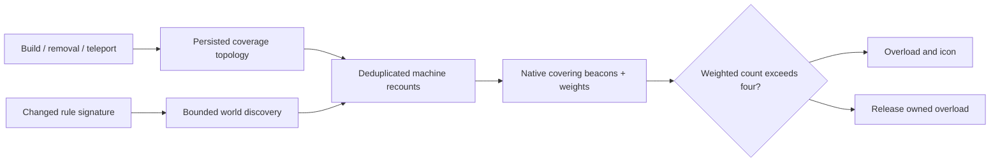

# Beacon overload topology and native diminishing-return profiles

## Implementation sources

- [beacon-overload.lua](../../../exotic-space-industries-remembrance/scripts/control/beacon-overload.lua)
- [beacon-profile-config.lua](../../../exotic-space-industries-remembrance/lib/beacon-profile-config.lua)

## Ownership and behavior

Runtime overload is a separate rule from the data-stage diminishing-return curve. `beacon-profile-config` generates the native 4,096-entry profile, settings choices, and matching tooltip parameters; it has no runtime polling. The overload module counts eligible native covering beacons, applies weights/exclusions, and overloads eligible machines when the weighted count exceeds four. `entity.get_beacons()` supplies actual coverage before filtering; a distance-only replacement would change semantics.

`storage.ei.beacon_overload` owns tracked machines/beacons, persisted beacon-to-machine edges, destruction-registration mappings, refresh queues, rule signatures, modes and diagnostic state. `storage.ei.overload_icons` owns render references. State changes affect machine `active` plus owned overload/icon state.

## Tick flow and bounded repair

The central per-tick fan-out calls `has_tick_work(event)` then `updater(event)`; the updater prefers the incoming tick. Work is mode-specific: release, machine recount, tracked reseed, or world discovery. World bootstrap discovers one chunk source and scans up to four chunks per tick; tracked/release limits are eight, with idle tracked/icon audit limits four/two every 60 ticks. Existing diagnostic helpers have eventless timing paths; changing those should use the common tick-policy review.

## Lifecycle and invariants

Destroy events remove graph relationships while the entity remains valid; object-destroyed registration supplies cleanup when it no longer is. Beacon teleport invalidates old edges before querying the destination, ensuring former neighbors are reconsidered. Configuration refresh compares the persisted rule signature (version 3); unchanged relevant rules avoid an unnecessary world rebuild. Disabling overload clears topology and queues release of owned overloads rather than leaving machines permanently inactive. Ordinary reload preserves queues/topology; a local surface iterator may be reconstructed.

## Verification and maintenance

Source inspection only. Reuse the `esir-dev` beacon-overload geometry helper for removal/teleport/native coverage and `scripts/invoke-beacon-profile-qc.ps1` for final native profiles. Validate same-tick multiple beacon removals, silent destruction, oversized collision boxes, ignored machines/beacons, threshold 4 versus 5, disable/re-enable, and reload during a world rebuild. Do not equate native profile effectiveness with the weighted runtime overload count.
