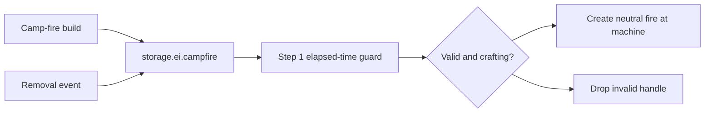

# Camp-fire registration and periodic fire emission

## Implementation sources

- [camp-fire.lua](../../../exotic-space-industries-remembrance/scripts/control/camp-fire.lua)

## Ownership and behavior

The module owns emission from registered `ei-camp-fire` crafting machines. Its registry is `storage.ei.campfire`; the wider ESIR initialization/topology paths provide the root, while this module adds/removes entities through forwarded build/destroy events. It has no GUI, remote interface, or independent registration.

## Tick flow and deadlines

`FIRE_UPDATE_TICK` is `max(150, ei_ticksPerFullUpdate)`. The step-1 gate compares `event.tick` to the persisted last-run tick and requires a nonempty registry. The updater records that same event tick before iterating. It creates `ei-small-fire`, or `fire-flame-on-tree` with the existing 25% choice, only while crafting; creation uses neutral force and raises a build event.

## Lifecycle and invariants

The module does not reconstruct its registry itself and assumes root setup precedes forwarded events. Invalid saved handles are removed during emission passes. Ordinary idle ticks do not walk all campfires. Once the elapsed guard opens, the implementation visits the entire registry; this is an observed population-scaled pass, not a fixed per-tick entity cap. Preserve that fact in performance claims. There is no catch-up loop producing multiple missed batches.

## Verification and maintenance

Source inspection only; no dedicated camp-fire fixture was identified in the targeted QC inventory. Use the existing runtime smoke surface plus a focused scenario for noncrafting machines, removal, stale registry entries, reload before the due interval, and neutral raised-build fire creation. A future cadence change must check both step-1 visit timing and the module interval.
