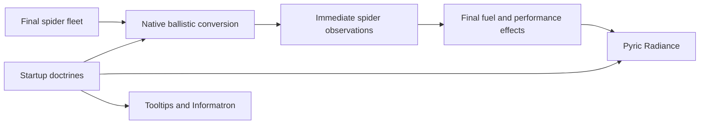

# Pyric Radiance and Ballistic Divergence

Four startup settings own two independent native-effect systems, both enabled with
Tempered by default. Ten doctrines per system share numerical records with startup
tooltips and Informatron. Selections persist while disabled. Concept credit:
DataCpt; independently authored implementation uses ESIR helpers and base art.
Optional counterpart identifiers occur only in dependency metadata. Runtime
warnings use the integrated names and leave both counterparts loadable.

## Implementation sources

- [pyric-radiance-config.lua](../../../exotic-space-industries-remembrance/lib/pyric-radiance-config.lua)
- [ballistic-divergence-config.lua](../../../exotic-space-industries-remembrance/lib/ballistic-divergence-config.lua)
- [combat-doctrines-dependencies.lua](../../../exotic-space-industries-remembrance/lib/combat-doctrines-dependencies.lua)
- [pyric-radiance.lua](../../../exotic-space-industries-remembrance/scripts/data-final-updates/pyric-radiance.lua)
- [ballistic-divergence.lua](../../../exotic-space-industries-remembrance/scripts/data-final-updates/ballistic-divergence.lua)

## Ownership and flow

Configs own scalars; private effects and flight coverage are data-stage derivatives.
Ballistics runs after fleet finalization and before spider observations. Radiance
runs last after fuel/performance aliases. Informatron reads stage-neutral configs.

## Payload preservation

Direct instant deliveries retain launch probability/repeats and source effects.
Each complete target payload moves to its own projectile; source-only siblings
remain instant. Unsupported conditional/scripted branches stay intact and are
reported once. Preserve source-type records/order. Capacity rounds upward once
per fully supported bullet item; shotgun/robot capacity stay native. Defender uses
its own payload. Shotguns retain cone, speed, geometry, pellet counts/penetration.
No new ammunition, progression or scripted damage.

Generated bullets use a 0.1-by-0.5 collision box and speed 1 tile/tick. `not-same`
prevents own-force interception; other allied forces and neutral terrain intercept.
Authored splash/fire filters stay intact. Piercing magazines receive a continuation
health budget of 25 times base physical damage. Native continuation crosses only
killed targets; a surviving target stops the projectile regardless of remaining
budget, as confirmed by the engine fixture and the
[Factorio developer explanation](https://forums.factorio.com/viewtopic.php?p=619879).
Exotic rounds remain single-impact.
Flight is `baseline * flight_multiplier / (1 - range_deviation/2)`, deviation below
2. Coverage includes final compatible ranges, ammo modifiers, quality and muzzle
allowance. A doctrine that would raise an external branch's deviation to 2 or
higher leaves that complete branch intact, reports the exclusion once, and still
declares its private helpers so saved identities do not depend on doctrine.
Acquisition range/cooldown/damage modifiers stay native. Terrain floors
preserve stronger resistance and affect all physical damage sources.
Rock eligibility includes the native rock-classification flag, covering Gaia
boulders, plus legacy rock names for compatible prototypes without that flag.

## Thermal boundary

The fuel catalog enumerates thermal fires/stickers/streams and palettes. Acid and
bespoke energy effects are excluded. Fire/stream lights keep colors. Stickers have
no light field: visible-only native effects create 12-tick light helpers every 12
ticks, preserving damage/lifetime cadence. Finite ordinary effect registries
preserve authored exotic bursts, plasma, Tesla, Lance, Emerald and special death
effects. Ordinary light radii cap at 64 and intensity at [0,1]. Extra nuclear
illumination uses a separate 30-tick light helper; the existing camera effect,
duration and damage stay intact. Spread,
effect lifetimes, maps, flashlights, night vision and day cycle retain their owners.
Each light is transformed once from original values.

## Lifecycle

Stable private projectile/light identities exist even when disabled. Data rebuild
leaves baseline source references intact in that mode. No items/technology/storage
need migration. Validate partial magazines/live effects through startup changes.
Saved native stacks can retain more remaining rounds than a newly reduced magazine
capacity; do not resize or refill them. Engine transitions verify their exact
remaining-round consumption. Disabled sticker/flash helpers retain stable names
with zero light intensity, while saved projectile helpers retain impact payloads.
The native transition fixture saves a fired legendary projectile with ammunition
and turret damage bonuses; disabled/Tempered rebuilds retain its single 45-damage
impact and exact saved magazine consumption. Both selections remain saved while
the toggles are disabled.

## Optional overlap warnings

[compat.warn_combat_overlap](../../../exotic-space-industries-remembrance/scripts/control/compat.lua)
checks each enabled startup toggle independently against optional dependency
metadata and prints one warning for that integrated system to a connected player.
[The shared dispatcher](../../../exotic-space-industries-remembrance/control.lua)
calls it only on `on_player_joined_game` and for connected players on
`on_singleplayer_init`. These hooks cover multiplayer joins and singleplayer save
loads; respawns and cutscene completion do not repeat the warning. No persistent
warning state or timer is needed. Neither `on_load` nor data-stage logging tries
to access players. Disabling a toggle preserves its saved doctrine selection.

## Timing

Combat effects need no control handler, script scheduler or runtime scan. The
load-entry warning is an untimed, read-only check with native player printing.
Native projectile simulation and sticker cooldown effects own engine work.
Evaluate rendering and simulation
separately from script UPS.

## Verification and limits

Use [the QC driver](../../../scripts/invoke-combat-doctrines-qc.ps1) and
[fixture notes](../../../scripts/qc/combat-doctrines/README.md). Cover twenty
doctrines/four toggle combinations, payloads, pellet counts, research/quality,
Defender/spiders, collision/penetration/range and save transitions. Headless results
cannot establish appearance; inspect graphical night scenes. Reports stay ignored.

Current focused engine evidence on 2.0.77 covers 24 final-data phases, 109 firing
cases per selected runtime doctrine, four real-counterpart toggle/load cases,
native save transitions, and shared localization translation. Night captures
cover disabled, Tempered and Apotheosis presentation with actual silo launches.
The separate 100-turret rendering scene contains 300 active projectiles and no
screenshot work. Its frame interval is display-limited, so CPU preparation/render
timings and headless simulation are useful bounded measurements; they do not
establish uncapped GPU cost or whole-factory UPS. MP client rejoin is not covered
by the singleplayer overlap fixture.
