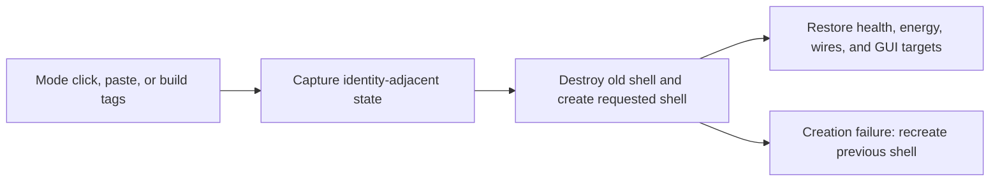

# Combustion turbine shell switching

## Implementation sources

- [combustion-turbine.lua](../../../exotic-space-industries-remembrance/scripts/control/combustion-turbine.lua)

## Ownership and reference flow

Solid and fluid fuel modes use different native turbine entities. `storage.ei.combustion_turbine` owns turbine records, proxy-to-owner mappings, object-destruction registrations, and GUI sessions. A hidden fluid-mode proxy provides an openable GUI anchor.

## Tick flow and invariants

This system is event-driven and has no production periodic updater. Event objects/numeric ticks flow through registration, shell swaps, GUI updates, and rebuilds. `now_tick` normalizes absent input to zero through `ei_lib.get_event_tick`, making its written `or game.tick` branch unreachable; some GUI boundaries explicitly capture `game.tick` before normalization. A shell swap changes unit number: capture connections and open players before destruction, then retarget every mapping. Switching to fluid mode spills burner inventories before replacement.

## Lifecycle and cleanup

Object-destruction callbacks distinguish the turbine from its proxy. Loss of a proxy can recreate it for a surviving fluid shell; loss of the turbine tears down its record/session. Rebuild removes orphan proxies and reconstructs both shell modes. Failed replacement attempts restoration and closes sessions if restoration also fails.

## Verification contract

Exercise both swap directions with fuel, quality, partial health, energy, circuit wires, multiple viewers, build tags, cloning, and settings paste. Inject replacement failure to verify restoration/GUI teardown. Verify player departure and independently destroyed proxy behavior with runtime QC; no new run is claimed.
