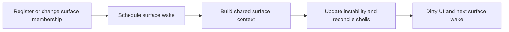

# Crystal accumulator resonance

## Admin repair

`repair_runtime_state` re-registers live shells in place and rebuilds surface aggregates/frontiers. Instability, energy history, cooldowns and frozen state remain on each existing record; missing scheduling is repaired without replacing valid paid state.

## Implementation sources

- [crystal-accumulator.lua](../../../exotic-space-industries-remembrance/scripts/control/crystal-accumulator.lua)

## Ownership and reference flow

`storage.ei.crystal_accumulator` owns live-shell records, per-surface membership/aggregates, delayed surface wakes, ready queues, and UI state. Each record carries instability and shell identity; surface context supplies profile, quality-weighted crowding, electrical activity, and platform conditions.

## Tick flow and invariants

The staggered dispatcher budgets whole surface passes; a separate gated every-tick UI path services due presentation. `now_tick` delegates to `ei_lib.get_event_tick`, so callers must supply the event/numeric tick. Surface service copies unit keys before processing because shell replacement mutates membership. Rebuild context after aggregate invalidation so later records in the same pass do not use stale crowding.

## Lifecycle and cleanup

Registration reconciles Gaia/base shells immediately. Mining handlers substitute the appropriate carried husk state; repair reintroduces a live shell. Destruction, platform state changes, selection, alternate area selection, GUI close, and player departure invalidate only the relevant records/UI. Init/configuration rebuild derives live membership and queues from world state. Preserve instability across ordinary shell swaps and the explicitly separate repair reset.

## Verification contract

Test multiple crystals on one surface, cross-surface membership, quality weighting, swaps during a surface pass, instability thresholds, mining by player/robot/platform, repair, platform transit, reload, and stale UI. Verify simulation and UI wake gates independently. No dedicated fresh engine results are supplied by this model.
