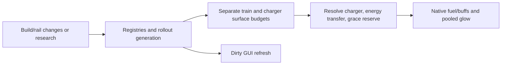

# EM train charging and research rollout

## Implementation sources

- [charger.lua](../../../exotic-space-industries-remembrance/scripts/control/em-trains/charger.lua)
- [gui.lua](../../../exotic-space-industries-remembrance/scripts/control/em-trains/gui.lua)
- [informatron.lua](../../../exotic-space-industries-remembrance/scripts/control/em-trains/informatron.lua)

## Ownership and reference flow

`storage.ei_emt` owns charger/train registries, spatial charger lookup, per-surface queues, research-derived buffs and rollout generations, rendering pools, and dirty GUI state. `charger.lua` owns simulation; `gui.lua` owns the mod button/panel. The current Informatron sibling contains only comments and is retained as an inactive content placeholder.

## Tick flow and invariants

Dispatcher steps 8/9 pass `event.tick` into train/charger updates. Helpers resolve a supplied tick first and use `game.tick` only when none is provided. Keep surface quota fairness, bounded research rollout, rail-count audits, and glow lifetime tied to the same service tick. Research receivers report actual changes; scripted research bursts refresh derived state through the existing burst contract.

## Lifecycle and cleanup

Entity and rail lifecycle updates registries, spatial membership, and affected rail counts. Removal destroys pooled glows and pending queue membership. Init/configuration rebuild reconstructs chargers/trains; player readiness and research access control mod-button visibility. The GUI updates through a dirty gate rather than an independent periodic full scan.

## Verification contract

The [event tick fixture](../../../scripts/qc/event-tick/README.md) contains EM glow timestamp checks. Exercise equal/unequal surface populations, research bursts, rail changes, charger power loss, locomotive grace fuel, quality, entity removal, reload, and access loss with an open panel. Do not equate local function timings with factory UPS.

## GUI refresh cost

Dirty EM panel refresh builds one scalar summary per viewed surface and shares it among viewers. Direct registry counts avoid temporary entity arrays. Each panel retains a scalar signature and skips unchanged caption assignments. Closed panels perform no registry summary work; no polling is introduced.

## Administrator repair

The admin registry calls `repair_runtime_state(reason,tick)`. It rebuilds derived
charger/train registration and rendering while preserving each still-valid native
locomotive's earned, unexpired `grace_until_tick`. The deadline is copied back only
when the rebuilt record refers to the same live locomotive. It does not restore
old queues, research rollout generations or rendering handles. Native burner fuel
remains owned by the locomotive. Legacy reset/rebuild entry points keep their
existing semantics. The active preservation fixture checks two repairs followed
by an out-of-coverage train update in the same tick.
