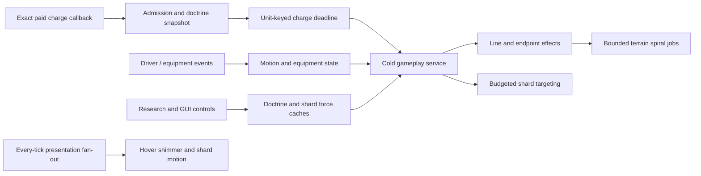

# Emerald Apocalypse charge, doctrine, motion, and orbital shards

## Implementation sources

- [emerald-apocalypse-hover-tank.lua](../../../exotic-space-industries-remembrance/scripts/control/emerald-apocalypse-hover-tank.lua)
- [emerald-apocalypse-orbital-shards.lua](../../../exotic-space-industries-remembrance/scripts/control/emerald-apocalypse-orbital-shards.lua)
- [emerald-apocalypse-hover-tank-config.lua](../../../exotic-space-industries-remembrance/lib/emerald-apocalypse-hover-tank-config.lua)
- [emerald-apocalypse-hover-tank-hover-offsets.lua](../../../exotic-space-industries-remembrance/lib/emerald-apocalypse-hover-tank-hover-offsets.lua)

## Ownership and behavior

The tank module owns charge admission/completion, enforced core/shield equipment, doctrine research caches and player toggles, scripted drift, endpoint damage/scars, shield reprisal, hover visuals, relative GUI and diagnostics. Its schema-13 root is `storage.ei.emerald_apocalypse_hover_tank`; orbital shards own a nested record/cache/targeting/visual state through their companion module. Hover fidelity config and generated 64-direction foot offsets control presentation, not doctrine damage.

The paid native charge callback snapshots the doctrine profile before scheduling wind-up. Pending/cooldown rejection refunds the already-spent charge; later aim changes do not refund a committed shot. The source comment and `consume_charge_item` adapter account for prototype consumption: do not add a second inventory debit.

## Tick flow and budgets

Event adapters normalize and pass their tick through gameplay, GUI and shard calls; eventless rebuild/QC accepts an explicit numeric tick. Base wind-up is 569 ticks and base post-shot cooldown 900, modified through the snapshotted doctrine profile. Cached next-charge/pulse deadlines admit work. The dispatcher preserves once-per-tick cold service with fallback outside the rotating slot. Cold work services due charges, drift, shield cleanup, terrain jobs and shard targeting; hot hover and hot shard motion are separate paths.

Shard targeting scans at 12-tick intervals with a default service cap of 24; hot visual service caps at 64 records. Base shard cooldown is 70 ticks and research can reduce it. Terrain batches visit at most 96 candidates and write 32 eligible tiles, with two job services and a two-tick interval. These limits must not be interpreted as an elapsed-time performance guarantee.

## Lifecycle and invariants

Build/clone/destruction registration, driver changes and equipment events maintain tank ownership. Research and scripted bursts refresh force caches/status/GUI. Rebuild closes GUI, replaces derived queues/registrations and rediscovers live tanks while retaining per-tank settings; it is not ordinary save/load replay. Delayed charge buckets carry unit IDs and revalidate records/entities on service. Cosmetic shard handles use short TTL safety and reuse; do not move targeting scans into their hot visual path. Stored handles never establish current validity.

## Verification and maintenance

Source inspection only. The `esir-dev/references/emerald-doctrine-qc-helper.md` fixture supplies deterministic doctrine snapshots through existing runtime QC methods, but explicitly does not replace feel/visual checks. Verify consumed/refunded charges, wind-up and cooldown, equipment restoration, doctrine changes mid-charge, per-tank toggles, source destruction, reload, shield reprisal, terrain eligibility and both targeting modes. Add separate visual review for drift, shard motion, and emitter-offset fidelity.
