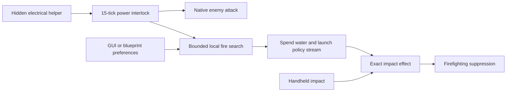

# Impact firefighting and powered water-turret service

## Implementation sources

- [firefighting.lua](../../../exotic-space-industries-remembrance/scripts/control/firefighting.lua)
- [water-turret.lua](../../../exotic-space-industries-remembrance/scripts/control/water-turret.lua)
- [firefighting-config.lua](../../../exotic-space-industries-remembrance/lib/firefighting-config.lua)

## Ownership and behavior

`firefighting` owns impact-only fire removal and no persistent state. Handheld impacts intentionally remove all fire entities in their small square, including acid. Water impacts use the explicit thermal catalog and optionally the weapon-fire catalog. Exact impact IDs encode the launch-time policy. Legacy extinguisher markers are consumed on creation; configuration cleanup removes stale markers without treating them as new impacts.

`water-turret` owns `storage.ei.water_turret`: turret/power-helper records, destruction registrations, exact power deadlines, fire deadlines and a bounded ready queue. Native fluid-turret behavior owns enemy acquisition and combat. The relative GUI stores enemy-first, fire-first, or fire-only preference plus whether weapon fires may be extinguished. Shared config owns both prototype/runtime identities and service constants.

## Tick flow and deadlines

Builds and events pass `event.tick`. Power checks reschedule exactly +15 ticks and are not deferred by the fire-query budget. Fire deadlines wake a shared queue; at most 32 queue entries are consumed per tick, including tombstones. Initial discovery is staggered by unit number. A retained valid fire uses 60-tick pulse cadence; no target uses the configured seconds-to-ticks search interval. A pulse consumes 15 water and refunds it if stream creation fails. Rebuild accepts a tick or resolves `game.tick` at that eventless boundary.

## Lifecycle and invariants

The 40k/30k electrical thresholds provide hysteresis. Circuit disable, recipe disable, freezing, deconstruction, and another script's inhibit prevent scripted firing. `owns_inhibit` ensures this module clears only the disable it acquired. Teleport rebinds/recreates the helper without transferring stored charge across disconnected locations. Object destruction, surface deletion, force merge, cloning, blueprint/settings paste and rebuild repair record ownership. Rebuild preserves preferences, releases owned inhibits, recreates empty helpers, and tears down stale relative panels. Manual and water fire policies must remain different.

`has_open_gui_session` lets central GUI routing preserve stale-panel cleanup when another GUI opens or closes. Widget changes route by the water console's parent tag. Clone dispatch must still reach hidden power helpers so their copied instances are removed.

## Verification and maintenance

Source inspection only. Reuse `scripts/invoke-water-turret-qc.ps1` and its README for native combat, fire modes, power/circuit interlocks, exact water use, protected weapon fires, acid exclusion, helper lifetime, save/load and visual muzzle cases. Per-module timing profiles are not whole-engine UPS or multiplayer proof.
