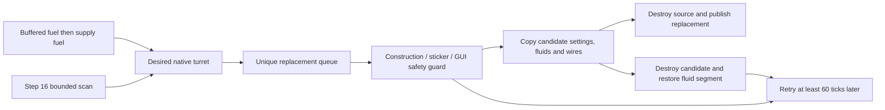

# Flamethrower fuel variants and replacement transactions

## Admin repair

`repair_runtime_state` rediscovers turrets/ghosts and synchronizes derived force modifiers using existing stable registration. It retains the live runtime root and replacement/retry work rather than using configuration rebuild's root replacement.

## Implementation sources

- [flamethrower-fuels.lua](../../../exotic-space-industries-remembrance/scripts/control/flamethrower-fuels.lua)
- [flamethrower-fuels.lua](../../../exotic-space-industries-remembrance/lib/flamethrower-fuels.lua)

## Ownership and behavior

The shared catalog owns fuel identities, native damage/lifetime parameters, hidden turret names, ammunition unlocks, and exact weapon-fire/sticker sets. Runtime selects the matching native turret prototype from the actual fuel and performs a guarded replacement. It does not synthesize firing or damage. The private firing buffer takes precedence over connected supply fluid, and an empty buffer/supply retains the current appearance.

`storage.ei.flamethrower_fuels` owns stable records, current unit and destruction-registration maps, scan/replacement queues, retry buckets, and counters. Stable record identity survives prototype replacement. A transaction flag prevents the module from treating its own temporary entities as independent builds/removals.

## Tick flow and budgets

The dispatcher supplies `event.tick` and its service interval to step 16. Fuel reads and queued attempts share the configured `ei-max_updates_per_tick` budget; queue visits are separately bounded, including tombstones. Scans set next-check tick +60; failed/unsafe replacements set retry tick +60. Retries use `delayed_take_due_through`, so a rotating dispatch visit can service overdue deadlines. Rebuild is eventless and seeds events with `game.tick`; existing build fallback accepts that same boundary.

## Lifecycle and invariants

Build/clone/destruction registration maintain inventory. Initialization/configuration rediscover live turrets and ghosts, synchronize force modifiers, and restore ordinary turrets when adaptation is disabled. Blueprints normalize variant names to the ordinary turret. Safe replacement preserves settings, quality, health/statistics, priority targets, indexed fluids, pipe connections and circuit wires; rollback retains the original entity and restores connected fluid state. Open GUIs defer replacement.

Creation-order cleanup is event-only: newest recognized stickers replace prior recognized stickers; different recognized ground-fire types within one tile compete, while equal types coexist. Acid/tree fire are outside this weapon-fire catalog. Native refueling is not a new creation event.

## Verification and maintenance

Source inspection only. Reuse `scripts/invoke-flamethrower-fuels-qc.ps1` and `scripts/qc/flamethrower-fuels/README.md`, including transition, fluid-matrix, overlap, and rollback fixtures. Verify both startup modes, private-buffer versus supply disagreement, same-tick different-fire impacts, replacement failure, and save/reload with pending retries.
