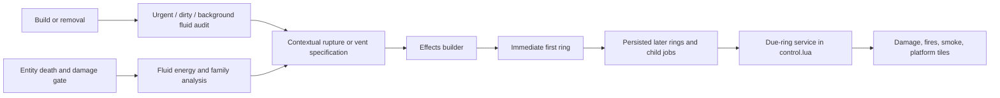

# Fluid safety, flammable death, and staged rupture effects

## Implementation sources

- [fluid-safety.lua](../../../exotic-space-industries-remembrance/scripts/control/fluid-safety.lua)
- [flammable-fluids.lua](../../../exotic-space-industries-remembrance/scripts/control/flammable-fluids.lua)
- [fluid-rupture-effects.lua](../../../exotic-space-industries-remembrance/scripts/control/fluid-rupture-effects.lua)
- [flammable-rupture-scheduler.lua](../../../exotic-space-industries-remembrance/scripts/control/flammable-rupture-scheduler.lua)
- [fluid-safety-config.lua](../../../exotic-space-industries-remembrance/lib/fluid-safety-config.lua)

## Ownership and behavior

Two producers share one effect pipeline. Fluid safety classifies tracked carriers and their segments, detects incompatible fluid, and chooses breach/vent behavior. Flammable death analyzes dying entities' fluidboxes, excludes pumps and configured ignored names, applies a damage-type probability gate, and builds an energy/family rupture specification. `fluid-rupture-effects` converts either producer's specification into contextual ground/platform jobs; it owns no persisted state.

`storage.ei.fluid_runtime` owns entity entries, segment membership, the urgent and dirty queues, and round-robin scan state; `storage.ei.fluid_entity` is compatibility inventory. `storage.ei.flammable_ruptures` owns staged jobs, ring buckets, cached pending counts, and next-ring admission. The ignore-list config is shared by settings and runtime and maintains only a reloadable local cache.

## Tick flow and budgets

The rotating dispatcher's step 2 supplies its event and entity budget to `service_fluid_runtime`. A single-slot budget uses weighted urgent/urgent/dirty/urgent/scan rotation; larger budgets reserve urgent, dirty, and background opportunities before continuing the rotation. Segment member actions cap at 32. Aftermath cooldowns and notifications use the supplied service tick.

The effects builder forwards the tick to `begin_rupture`, which executes the first ring immediately and queues later work. Normal ring progression schedules the next ring at current service tick +1; fidelity modes may aggressively drain remaining rings. Due admission uses cached next due/counts, then consumes all overdue buckets.

Observed tick debt: fluid service currently replaces a normalized tick <=0 with `game.tick`, and `queue_rupture` clamps due time through `now_tick()` even when the caller supplies a deadline. These are existing contracts to evaluate with tick-zero/boundary tests, not behavior changed by this reference.

## Lifecycle and invariants

Registration changes repair segment membership and enqueue work. Configuration changes reset the ignore cache and rebuild only when mods/startup settings changed; discovery scans occur there, not as each tick's registration mechanism. Persisted queue version 2 normalizes older queue representations. Queued entities are revalidated during service; effect jobs carry enough surface/position context to survive source removal. Job counts and next-due metadata must remain consistent when rings finish or fail.

## Verification and maintenance

Source inspection only. Reuse `esir-dev/references/fluid-rupture-qc-helper.md` for family/carrier/platform scenarios and `scripts/qc/event-tick` for fluid warning timing. Test sustained urgent churn with budget 1, dirty/background fairness, ignored names, empty/dead entities, overdue rings, and reload midway through a rupture. Operation budgets do not prove a whole-factory UPS result.
