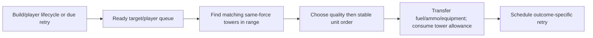

# Fueler tower servicing

## Implementation sources

- [fueler.lua](../../../exotic-space-industries-remembrance/scripts/control/fueler/fueler.lua)
- [informatron.lua](../../../exotic-space-industries-remembrance/scripts/control/fueler/informatron.lua)

## Ownership and reference flow

Fueler runtime owns tower/target spatial indices, per-surface ready targets, delayed target/player retries, tower service budgets, connected-player state, and tower GUI preferences under `storage.ei`. The nested Informatron module registers its content interface during control loading.

## Tick flow and invariants

Dispatcher step 6 supplies the event. Housekeeping runs once per tick, releases due work, and services one ready target or player per call. Current rebuild timestamps and context-free pending-count calls retain `game.tick` fallback. Preserve successful, failed-action, moving, and static retry policies; these are part of service latency. Tower preference, quality ranking, same-force/range checks, and per-tick service allowance all constrain selection.

## Lifecycle and cleanup

Build/destroy registers or removes towers and supported targets. Player lifecycle marks/synchronizes service state and removes pending player work on departure. Init/configuration rescan rebuilds world-derived indices, while bounded normal service validates references. Settings GUI changes synchronize the indexed tower preferences. Informatron has no independent tick loop or persistent simulation state.

## Verification contract

Use [control UPS fixture](../../../scripts/qc/control-ups/README.md) for parity methodology. Test multiple tower qualities, exhausted service budgets, moving targets, cross-force exclusion, equipment-only mode, absent supplies, player reconnect, invalid delayed targets, and rebuild. Verify inventory conservation and retry timing; this blueprint adds no performance measurement.
