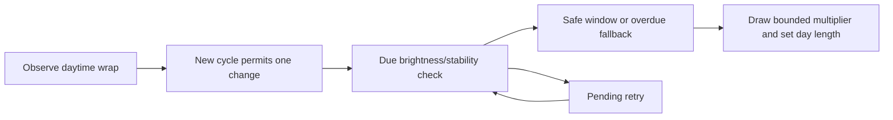

# Fulgora day-length variation

## Implementation sources

- [fulgora-day-length-variation.lua](../../../exotic-space-industries-remembrance/scripts/control/fulgora-day-length-variation.lua)

## Ownership and reference flow

The module changes the native Fulgora surface's `ticks_per_day`. Its actual state is `storage.ei.fulgora_day_length_variation`: multiplier bounds, cycle index, last daytime/darkness, last applied cycle, and next/pending checks. The older file-header reference to a top-level storage field is not the implementation owner.

## Tick flow and invariants

The global tick path is gated by Fulgora's existence. The updater uses `event.tick` throughout: ordinary checks include a small cadence jitter, pending checks retry every 60 ticks, and a full-standard-day timeout permits progress when brightness guards keep rejecting. A cycle changes at most once. Preserve daytime-wrap observation even when an expensive check is not due.

## Lifecycle and cleanup

The module returns when the surface or `storage.ei` is absent and lazily initializes variation state from configured bounds. Surface replacement/reconfiguration must be reviewed against its retained cycle fields; the module exposes no standalone rebuild/reset hook. It owns no entity helpers or render objects.

## Verification contract

Test absent Fulgora, first initialization, daytime wrap, bright/stable and dark/unstable windows, pending timeout, once-per-cycle behavior, bounds, and reload. Inspect continuity visually as well as `ticks_per_day`; a structural model does not establish that every transition is visually smooth.
