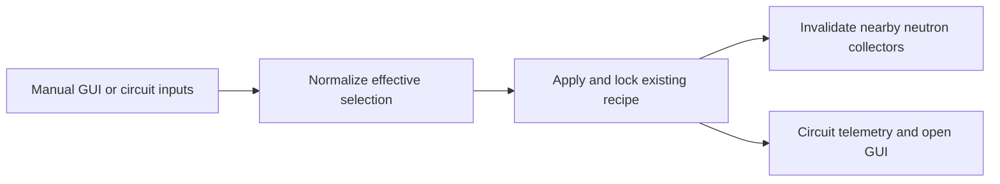

# Fusion reactor control and telemetry

## Admin repair

`repair_runtime_state` reconstructs dense indexes and missing wire helpers in place. Manual selection, circuit-control choice, effective recipe and live fluid/inventory contents survive; repair does not apply a new selection.

## Implementation sources

- [fusion-reactor.lua](../../../exotic-space-industries-remembrance/scripts/control/fusion-reactor.lua)

## Ownership and reference flow

The reactor remains a native recipe-driven machine. `storage.ei.fusion_reactor` owns reactor records, indexed service order, manual/effective selections, control-source mode, wire proxies, and open players. Selection normalization maps fuel pair, temperature, and injection mode onto an existing recipe.

## Tick flow and invariants

The staggered dispatcher supplies a budget/event to `update`; service walks the reactor index with a persistent cursor. Build and GUI recipe updates accept an event or numeric tick, with `game.tick` fallback for context-free callers. Preserve manual selections when circuit control supplies effective values, and only notify neutron collectors when the native recipe changes. Telemetry output must not be mistaken for external circuit input.

## Lifecycle and cleanup

Init/configuration rebuild destroys old/orphan wire proxies and reconstructs reactor entries from current world recipes. Build registers and services immediately; settings paste carries control settings through normalization. Destruction removes registry membership, proxy, and affected GUI sessions. Rebuild currently reconstructs control entries rather than promising preservation of every historical GUI choice.

## GUI refresh ownership

`open_by_player` remains the viewer owner. Reactor service supplies its existing entry to viewers, avoiding registration/recipe discovery per viewer. GUI writes depend on normalized effective/manual selections, control source and wire state; identical state leaves sliders and fuel controls untouched. Local render snapshots are disposable and close/leave clears them. Reconcile an existing console on player join so a saved window resumes subscriptions. Recipe, collector and circuit service behavior is unchanged.

## Verification contract

Test manual/circuit transitions, absent or partial circuit signals, recipe changes observed by neutron collectors, copy/paste, proxy destruction, open-console removal, and configuration rebuild. Use runtime QC and inspect both recipe identity and circuit outputs. No new engine validation is asserted here.
