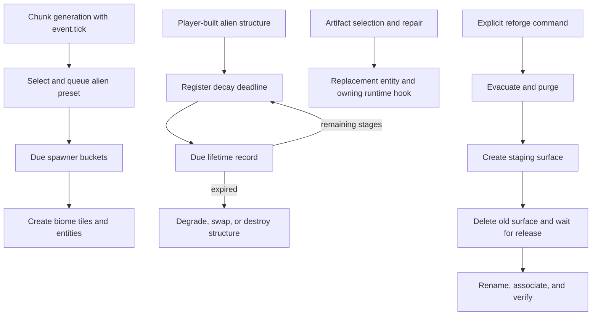

# Gaia surfaces, alien presets, and artifact progression

## Implementation sources

- [gaia.lua](../../../exotic-space-industries-remembrance/scripts/control/gaia.lua)
- [gaia-mapgen-data.lua](../../../exotic-space-industries-remembrance/scripts/control/gaia-mapgen-data.lua)
- [alien-system.lua](../../../exotic-space-industries-remembrance/scripts/control/alien-system.lua)
- [alien-spawner.lua](../../../exotic-space-industries-remembrance/scripts/control/alien-spawner.lua)
- [spawner-presets.lua](../../../exotic-space-industries-remembrance/lib/spawner-presets.lua)
- [biomes.lua](../../../exotic-space-industries-remembrance/prototypes/planet-gaia/biomes.lua)
- [1.3.03.lua](../../../exotic-space-industries-remembrance/migrations/1.3.03.lua)
- [1.3.39.lua](../../../exotic-space-industries-remembrance/migrations/1.3.39.lua)

## Behavior and ownership

Three cooperating owners remain distinct. `gaia` manages the Gaia planet/surface association, explicit reforge state machine, and decay of registered alien structures. `alien-spawner` creates biome-aware presets, guardians, and delayed chunk work. `alien-system` manages per-force alien currency/unlocks, confirmation UI, and artifact repair. `gaia-mapgen-data`, `spawner-presets`, and the shared biome tables supply configuration/data rather than event registration.

State roots are `storage.ei.reforge_gaia`, `damage_tick_buckets`/`damage_tick_next_due_tick`, `spawner_buckets`/`spawner_next_due_tick`, flower/legendary spawn records, and `storage.ei.alien[force.name]`. `storage.gaia_surfaces` is the compatibility surface registry, shared with the integration interface.

## System invariants and interactions

`ensure_surface` and `migrate_gaia_surface` reconcile the actual planet association and legacy surface names. Reforge is an explicit destructive operation; ordinary initialization must not replay it. `reforge_gaia_surface` requires the planet and a safe return surface and refuses to start another run while state exists. `reforge_on_tick` advances `migrate_legacy → check_intact → evacuate → purge → stage_surface → queue_delete → wait_for_release → rename_and_bind → verify`, with completion/failure handling and retry bounds. Preserve the staging/association sequence instead of renaming the legacy planet blindly.

`alien-spawner.on_chunk_generated` schedules a preset for the next tick on an allowed surface. `update` drains due work and currently discards jobs more than ten ticks overdue; this age cutoff is gameplay policy, not a generic scheduler behavior. Preset/biome helpers preserve themed tree/tile choices. Legendary completion is recorded only at the appropriate entity-spawn phase. Destruction of eligible untouched alien structures may trigger guardians.

`gaia.register_entity` tracks supported structures with a last-user requirement unless explicitly overloaded. `update_entity_lifetimes` revalidates each queued entity, reduces its remaining stage value, displays that value, and eventually degrades the building. Artifact repair preserves quality, removes the selected original, consumes the cursor tool, calls the crystal runtime's repair hook when present, and increments victory statistics.

Alien purchases use force-name-owned currency/unlock state and a confirmation GUI. The current confirmation handler consumes the nested tags' cost/name; it does not repeat every eligibility test made when opening confirmation. Do not claim the UI already provides a general transactional/concurrent-purchase guarantee.

## Tick flow

Chunk work derives deadlines from `event.tick + 1`; lifetime registration derives its deadline from `event.tick + entity_damage_ticks[name]`. Both due queues catch up through the service tick and use derived earliest-due guards. Gaia reforge runs in coordinator slot one; damage and spawner drains run in the mandatory tier only when due. Pass the supplied tick through reforge phases and delayed work. Existing status or explicit no-event entrypoints use current-clock fallbacks; ordinary events already carry the authoritative tick.

## Lifecycle and upgrades

Old flat decay/spawner queues are normalized into bucket structures by the owning modules. Configuration handling invalidates derived due minima so persisted work remains discoverable. Missing/invalid entities are skipped at lifetime consumption; surface deletion/rebinding must also account for queued surface references and feature-owned helpers.

Migration `1.3.03` associates the existing legacy Gaia surface when the current planet lacks one; it does not rename the legacy space location. Migration `1.3.39` removes exact legacy resource overrides and preserves customized settings/nonmatching overrides. Its map-generation changes affect future chunks, not regeneration of existing terrain. Keep ordinary migration repair separate from the intentional reforge command.

## Verification and limits

The [Gaia resource QC guide](../../skills/esir-dev/references/gaia-resource-qc.md) documents native multi-seed/resource-control probes. The [queue lifecycle fixture](../../../scripts/qc/control-ups/queue-save.lua) and [driver](../../../scripts/invoke-control-lifecycle-qc.ps1) provide persisted delayed-work checks.

Verify legacy association, custom mapgen preservation, due queue migration, stale entities, preset aging/legendary completion, artifact quality and crystal re-registration, and every reforge transition with players and existing surfaces. Resource-preview success does not prove reforge safety, artifact GUI behavior, geographic distribution, or multiplayer parity. This model records source-derived behavior and available checks; no new engine results are asserted.
