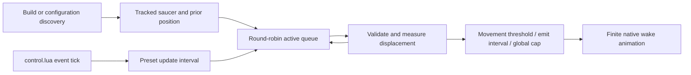

# Gaian saucer wake registration and bounded visual emission

## Implementation sources

- [gaian-saucer-wake.lua](../../../exotic-space-industries-remembrance/scripts/control/gaian-saucer-wake.lua)
- [gaian-saucer-wake-config.lua](../../../exotic-space-industries-remembrance/lib/gaian-saucer-wake-config.lua)

## Ownership and behavior

The wake is cosmetic: registered `ei-gaian-saucer` movement produces chromatic animation bursts. `storage.ei.gaian_saucer_wake` owns tracked entity records, position/direction history, active queue/counts and counters; the module's local config/runtime-active cache is disposable. The shared config defines off/lean/standard/cinematic/maximal/unbounded presentation settings.

## Tick flow and budgets

The updater resolves the supplied event tick, tests the preset update interval, and forwards that tick through service and records. Standard uses interval four, service cap 32, global burst cap 32, and minimum per-unit emit interval four; numerical changes belong in the config. A service visit updates remembered position even when its emission is capped, so capped work is not accumulated as a catch-up burst. Status publication has a 300-tick cadence. Rebuild, diagnostics and raw-entity adapters retain eventless fallback through `resolve_tick`; `check_global` also uses `game.tick` for initialization status.

## Lifecycle and invariants

Build/destroy forwarding handles normal ownership; service revalidates and removes stale handles. Configuration rebuild resets visual cache/state and scans live saucers only if enabled. Off mode clears runtime activity and avoids modulo on its zero interval. Ordinary load recovers admission from persisted counts/queue when the local active cache is unset. No gameplay damage, force upgrade, fuel or movement contract is owned here; extending wake visuals must not silently alter those systems.

## Verification and maintenance

Source inspection only. Existing central `exotic-industries-qc` methods reset/service/snapshot the wake module. Use those for off/empty/active registry, explicit tick, caps, removal and rebuild checks; no dedicated wake runner was found in the targeted script inventory. Visual checks should cover straight travel, turns, near-stationary drift, large population rotation and reload. Per-module caps and snapshots alone do not demonstrate a whole-engine UPS improvement.
