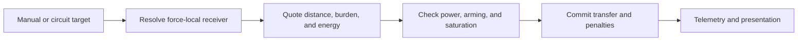

# Gate transport and receiver selection

## Implementation sources

- [gate.lua](../../../exotic-space-industries-remembrance/scripts/control/gate.lua)

## Ownership and reference flow

`storage.ei.gate` owns sender/container pairs, receiver IDs and lookup state, selector sessions, wire proxies, stress/saturation, render handles, and the sender service cursor. Distance quotations use the shared surface-anchor helper; item transport preserves item/quality identity.

## Tick flow and invariants

Dispatcher step 7 passes the event to bounded sender service. Receiver refresh and GUI housekeeping run once per supplied tick even when the dispatcher requests multiple units. The current module still contains a direct `game.tick` read in permission restoration; it is a documented audit point, not proof of event-tick compliance. Keep quotation separate from payment and preserve elapsed-time penalty decay.

## Lifecycle and cleanup

Build/destroy hooks register sender/container/receiver relationships. Receiver changes invalidate target resolution; sender destruction removes proxies, render state, and remote-selection ownership. GUI/area/cursor events drive manual destination selection, and player departure closes it. Init/configuration rebuild repairs registries and cached distance data. Unit-number changes must update every registry and GUI tag.

## Verification contract

Test same/cross-surface transfer, quality-bearing items, unavailable/full receivers, insufficient energy, saturation, circuit changes, target deletion, cancelled remote selection, player cleanup, and reload. Compare transferred contents and charged energy. Preserve native transport policy while modifying documentation or tick plumbing.
