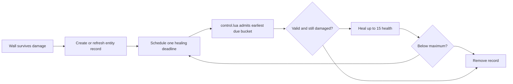

# Hemocrystal wall event-started regeneration

## Admin repair

`repair_runtime_state` reconstructs due buckets from living damaged-wall records and discovers otherwise untracked damaged walls. Native health and valid future deadlines survive; overdue work resumes on a future tick.

## Implementation sources

- [hemocrystal-wall.lua](../../../exotic-space-industries-remembrance/scripts/control/hemocrystal-wall.lua)

## Ownership and behavior

Damage starts regeneration for `ei-hemocrystal-wall`. `storage.ei.hemocrystal_wall` schema 1 owns records keyed by wall unit number, shared delayed buckets, and cached earliest due tick. Full-health walls are not registered as periodic work.

## Tick flow and deadlines

The damage event schedules `event.tick + 60` only when no deadline is already present; additional hits do not postpone it. Service receives `event.tick`, heals `0.25 * 60 = 15` capped at current maximum health, and schedules the next +60 from actual service time if still damaged. The updater consumes the earliest recorded bucket, including when overdue, then recomputes the next deadline. It does not perform an elapsed-time catch-up heal. The whole due bucket is serviced: there is no separate entity-per-tick cap.

## Lifecycle and invariants

Destruction removes the record; an already queued ID becomes a harmless missing-record entry. Service validates entity name/validity/health and stops for dead or full-health walls. Configuration calls state normalization; a schema mismatch replaces records rather than scanning all existing walls. Ordinary reload retains queued deadlines. Event timestamps are authoritative; the optional status snapshot tick may use `game.tick` only when no tick was supplied.

## Verification and maintenance

Source inspection only; no dedicated wall fixture was identified. A focused engine scenario should cover first damage at tick zero, repeated hits before +60, exact due healing, externally healed walls, destruction, quality-dependent maximum health, multiple walls due together, and reload with a pending bucket. Check that no work remains after the last wall heals.
