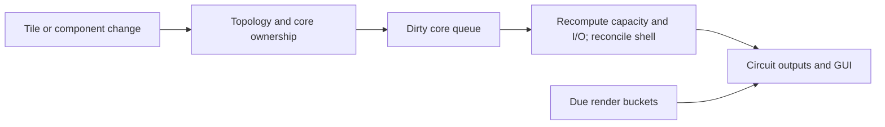

# Induction matrix topology and power

## Implementation sources

- [induction-matrix.lua](../../../exotic-space-industries-remembrance/scripts/control/induction-matrix.lua)

## Ownership and reference flow

`storage.ei.induction_matrix` owns logical core records, topology-derived stats, dirty-core queues, deferred removals, wire-proxy reverse mappings, render buckets, and telemetry service slots. Tile/entity hooks discover connected matrix topology and mark affected cores dirty.

## Tick flow and invariants

The main dispatcher calls the gated local `update(event)` each tick. It processes render deadlines, dirty matrices, and scheduled wire outputs; open GUI refresh is gated to every 15 ticks. Event ticks also drive temporary topology/stat render expiration. `has_tick_work` has a context-free fallback. Preserve core-ID remapping across shell swaps, stored power when applying changed capacity/I/O, and external circuit connections; do not recompute whole topology on every ordinary tick.

## Lifecycle and cleanup

Build/destroy/tile replacement can split, merge, or invalidate matrix membership. Duplicate cores and old IDs require explicit reconciliation, including GUI tags and proxy mappings. Init/configuration repair rebuilds live topology and scheduler metadata. Deferred renders and invalid cores must be cleaned even after the last ordinary component is removed.

## Verification contract

Use [control UPS fixture](../../../scripts/qc/control-ups/README.md) and the [follow-up lifecycle record](../../../scripts/qc/control-ups/followup-verification.md) as historical guidance. Test split/merge, duplicate cores, last-tile removal, shell upgrade/downgrade, saved energy, wire reconnection, delayed render expiry, and open-GUI destruction. Headless session tests are not a substitute for visual review.
