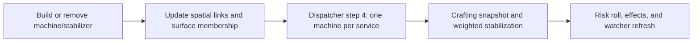

# Matter stabilizer containment

## Implementation sources

- [matter-stabilizer.lua](../../../exotic-space-industries-remembrance/scripts/control/matter-stabilizer.lua)

## Ownership and reference flow

The module owns machine/stabilizer registration, spatial links, containment risk, presentation, and the exotic assembler console. `storage.ei.matter_runtime` holds indexed machines and stabilizers, chunk buckets, per-surface queues, and rendering handles; legacy-facing registries and `matter_stabilizer_gui` remain separate compatibility/UI surfaces.

## Tick flow and invariants

`control.lua` supplies the event to `update`, which passes its tick into machine snapshots, warning cooldowns, and due GUI refreshes. `now_tick` still falls back to `game.tick` for context-free calls. Preserve the round-robin surface and machine cursors and the conversion from risk per second to probability per update; changing cadence without the probability conversion changes gameplay. Idle machines clear active effects and only retain snapshots when watched.

## Lifecycle and cleanup

Init/configuration changes and the admin rescan rebuild world-derived links and queues. Removal unlinks both directions, removes spatial/surface membership, and destroys associated effects and player render references. Cursor/selection/leave events own temporary range drawings; GUI sessions refresh only through their due queue. Do not replace indexed neighborhood queries with repeated full-surface scans.

## Verification contract

Review the [control UPS fixture](../../../scripts/qc/control-ups/README.md) and its lifecycle/GUI cases before changing dispatch or queue behavior. Test stabilizer insertion/removal, multiple surfaces, idle-to-crafting transitions, invalid queued entities, rebuild with open consoles, and player departure. Compare risk inputs and serviced order as well as visible effects. This model records source behavior; it adds no engine-run claim.
