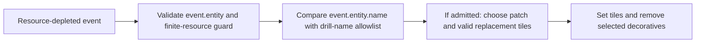

# Mining scar event path

## Implementation sources

- [mining-scars.lua](../../../exotic-space-industries-remembrance/scripts/control/mining-scars.lua)

## Ownership and reference flow

This module has no persistent storage or scheduled work. Its intended scar path chooses a randomized nearby patch, advances eligible terrain through a tile-degradation map, and removes selected decoratives.

## Tick flow and invariants

The handler does not need a tick; do not introduce either `event.tick` or `game.tick` simply for consistency. The implementation currently compares the depleted entity's name directly with quarry/drill names. This is a source-level mismatch between the received resource event and the documented drill intent; the model records it rather than asserting normal mining produces scars or silently fixing gameplay.

## Lifecycle and cleanup

All work is confined to one depletion callback. It excludes infinite resources, water-colliding tiles, hidden tiles, and missing replacement prototypes. It creates no durable records or helper entities. The degradation map contains compatibility tile names, so prototype existence remains necessary before applying a transition.

## Verification contract

Before changing behavior, establish the actual depletion payload and intended drill detection with an engine fixture. Then test allowed/disallowed drills, infinite resources, water, player-placed tiles, absent optional tile prototypes, and deterministic seeded replay. This documentation backfill does not claim that the existing allowlist path is reachable in ordinary mining.
