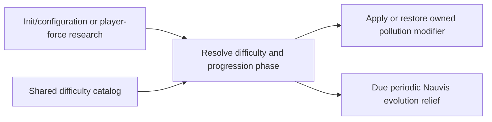

# Nauvis pressure grace and difficulty policy

## Admin repair

`repair_runtime_state` refreshes the current progression policy using the supplied boundary tick. It retains original pollution-factor restoration state and progression rather than resetting the grace root.

## Implementation sources

- [nauvis-pressure-grace.lua](../../../exotic-space-industries-remembrance/scripts/control/nauvis-pressure-grace.lua)
- [enemy-difficulty-config.lua](../../../exotic-space-industries-remembrance/lib/enemy-difficulty-config.lua)

## Ownership and reference flow

`storage.ei.nauvis_pressure` owns selected milestone policy, periodic evolution relief, and ownership bookkeeping for pollution-factor changes. The stage-neutral enemy-difficulty catalog supplies named profile defaults/multipliers to runtime, settings, prototypes, and Informatron; it owns no runtime state.

## Tick flow and invariants

Dispatcher step 1 checks `has_tick_work(event)`; ordinary relief runs at the 18,000-tick interval. Research/configuration paths synchronize policy immediately. Event or supplied numeric ticks are preferred; scripted-burst utility calls retain a fallback. Impossible, disabled, and inactive policies restore owned modifiers instead of continuing relief. Treat externally changed pollution factors as a new base rather than blindly restoring an obsolete saved value.

## Lifecycle and cleanup

The state schema preserves active modifier ownership across upgrades and discards stale unowned base values. Only the player force's progression drives this policy; foreign-force research is ignored. Policy changes clear/restore the module's modifier when no longer active. Missing Nauvis/enemy force stops the surface-specific relief path safely. Do not reinterpret difficulty profile values while documenting the system.

## Verification contract

Exercise Merciful/standard/Impossible policies, Classic/Extended progression, relevant power/defense milestones, scripted bursts, foreign-force research, disabled grace, externally changed pollution settings, tick-zero synchronization, and configuration reload. Verify restoration ownership as well as the chosen numerical policy. No fresh difficulty-balance or engine result is asserted.
