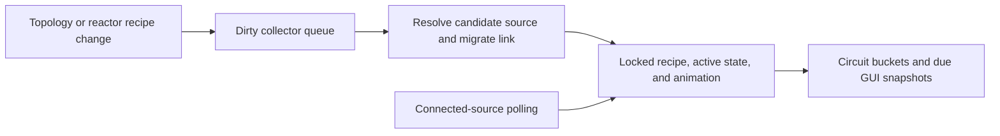

# Neutron collector source binding

## Implementation sources

- [neutron-collector.lua](../../../exotic-space-industries-remembrance/scripts/control/neutron-collector.lua)

## Ownership and reference flow

`storage.ei.neutron_runtime` owns collectors, source-to-collector links, a deduplicated dirty queue, connected-source polling, circuit proxies, and GUI sessions. Direction animations also use `storage.ei.neutron_collector_animation`. Source resolution computes candidate efficiency and binds a collector to the selected source; the resulting recipe and active state stay native entity behavior.

## Tick flow and invariants

Dispatcher step 3 obtains pending work and passes both a bounded budget and the event to `update`. Pending work includes dirty collectors, connected sources, due wire outputs, and GUI deadlines. `now_tick` uses `ei_lib.get_event_tick`; absent input normalizes to zero, so the written `or game.tick` fallback is unreachable under Lua truthiness. Preserve explicitly supplied ticks and establish real no-tick boundary time before normalization in future changes. Preserve dirty/poll alternation, deduplication, stable candidate ordering, and the 60-tick wire bucket phase. Recipe/animation changes are conditional on resolved output.

## Lifecycle and cleanup

Build/destroy/settings-paste and fusion recipe changes invalidate affected bindings. Removal must disconnect reverse source membership, remove wire scheduling, destroy proxies/animations, and close or refresh watchers. Rebuild clears stale proxies, registers world collectors, and resolves their initial links before returning.

## Verification contract

The [event tick fixture](../../../scripts/qc/event-tick/README.md) documents supplied-tick GUI deadline and budget checks; the [control UPS fixture](../../../scripts/qc/control-ups/README.md) covers additional parity work. Exercise loss/replacement of the preferred source, circuit disablement, changing fusion recipes, reload, and destruction while queued. Historical reports are evidence for their recorded sources, not new validation of this blueprint.
