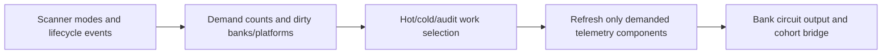

# Orbital scanner banks and demand caches

## Admin repair

`repair_runtime_state` unconditionally discovers scanners before rebuilding banks, platform caches and demand indexes. This repairs a partially missing registry while preserving per-unit scanner modes.

## Implementation sources

- [orbital-combinator.lua](../../../exotic-space-industries-remembrance/scripts/control/orbital-combinator.lua)

## Ownership and reference flow

The scanner owns `storage.ei.orbital_combinators`, bank and mode state, power sensors, platform caches, force/surface demand counts, hot/cold service queues, and optional probe records. Cohort logistics consumes narrow read-only bridge accessors rather than owning these caches.

## Tick flow and invariants

Dispatcher step 5 provides the event for each work slice. One update selects and services one work class, marks it served, and reports remaining work. Preserve class fairness, hot/cold cadence, same-surface mirroring, and mixed-key cursor handling. Most helpers accept a numeric tick with a context-free fallback; some platform utility paths still read `game.tick` directly and require review when changing propagation.

## Lifecycle and cleanup

Build/removal/settings paste, logistic-slot changes, platform movement, rocket/cargo-pod events, and object-destruction events invalidate specific cache components. Destroy callbacks distinguish a genuinely lost platform from a stale registration for one that still exists. Init/configuration rebuild repairs banks, helper power state, and platform indices. Demand transitions bootstrap newly requested data without eagerly scanning unused components.

## Verification contract

The [control UPS fixture](../../../scripts/qc/control-ups/README.md) includes scanner traversal and cached-count parity. Test demand-mode transitions, power loss, cargo lifecycle, platform deletion/replacement, multiple banks, hot/cold fairness, and ordinary/configuration reload. Check bridge payloads and actual circuit filters, not only queue counts.

## GUI refresh cost

Scanner power/mode changes refresh viewers of the affected bank. During one fanout, power and wiring summaries are computed once per bank and shared among viewers; no summary survives the event. Individual scanner power is read from the just-refreshed bank state. Unchanged modes, captions and power counts skip GUI assignments. The bank service remains the only scheduling owner.
