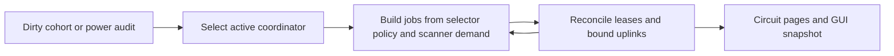

# Orbital logistics cohorts and leases

## Implementation sources

- [orbital-logistics.lua](../../../exotic-space-industries-remembrance/scripts/control/orbital-logistics.lua)

## Ownership and reference flow

`storage.ei.orbital_logistics` owns force/surface cohorts, transponder IDs, selectors, coordinators, uplinks, candidate jobs, target leases, dirty/power-audit queues, and GUI sessions. Scanner data enters through orbital-combinator bridge functions.

## Tick flow and invariants

Dispatcher step 10 passes the event to one cohort service slice. The update consumes pending rescans, then dirty cohorts before queued power audits. Numeric ticks flow into service, while init/QC/GUI utilities retain fallback reads. Per-pass scanner and silo caches must not escape that pass. Lease teardown may trigger one additional candidate rebuild in the same service so freed targets converge immediately.

## Lifecycle and cleanup

Build/destroy/settings paste and platform/rocket events dirty relevant cohorts. Selector modes and oversize policies determine jobs; coordinator arbitration and existing lane rotation determine dispatch. Removal, retargeting, lost power, invalid bindings, and launch confirmation reconcile or release leases. Rebuild reconstructs world entities and registries; GUI close/leave destroys associated silo overlays.

## Verification contract

The [control follow-up record](../../../scripts/qc/control-ups/followup-verification.md) documents a fixed-target fairness fixture and distinguishes GUI skips. Recheck sticky leases, competing fixed jobs, policy retargeting, mixed cargo, launch release, power loss, deleted silos, and reload. Existing historical results do not establish new multiplayer or interactive GUI coverage.
