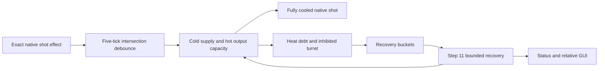

# Railgun coolant proxies, heat debt, and recovery

## Admin repair

`repair_runtime_state` retains live heat-debt records, deadlines and correctly bound coolant proxies. When a mismatched proxy must be replaced, its two fluid contents transfer to the new helper within prototype capacity; invalid owners use normal teardown.

## Implementation sources

- [railgun-cooling.lua](../../../exotic-space-industries-remembrance/scripts/control/railgun-cooling.lua)
- [1.3.40.lua](../../../exotic-space-industries-remembrance/migrations/1.3.40.lua)

## Ownership and behavior

Native railgun firing emits `ei-railgun-cooling-shot`. Runtime owns hidden orientation-specific fluoroketone proxies, fluid conversion, heat debt, inhibition/status, recovery work, hot-shot visuals and a relative GUI. `storage.ei.railgun_cooling` stores turret records, proxy/turret destruction mappings, surface membership, viewers, unique recovery queues/buckets, earliest due tick and visual tails.

A cooled shot converts up to 10 cold fluoroketone to hot, constrained by both supply and output room. Missing coolant creates capped debt, nonlethal health loss and temporary inhibition; repair service consumes coolant or later passive bleed. No extra scripted weapon damage is applied to the enemy.

## Tick flow and deadlines

Handlers pass event/numeric tick through `now_tick`; eventless callers keep its fallback. Repeated line-intersection callbacks within five ticks are ignored. Recovery is scheduled +60 ticks; passive bleed begins after 300 ticks without a shot. Step 11 admits overdue buckets and services queued units under the shared dispatcher's budget. Healthy railguns are absent from steady-state recovery work. Status/GUI use the same supplied tick for remaining-time and visual expiry.

## Lifecycle and invariants

Build/clone/rotation create or align proxies; destruction registration repairs missing helpers or removes turret ownership. Platform state changes invalidate the relevant surface profile. Rebuild removes old records/orphan proxies and recreates helpers, so do not use it as a fluid-preserving substitute for the dedicated migration.

Migration `1.3.40.lua` repairs cached inserter drop targets that still point at coolant helpers. It scans actual inserters, resolves a railgun intersecting the drop tile, and retargets or clears that target without rebuilding helpers or discarding coolant. Prototype item-handling exclusions and this saved-target migration solve different lifecycle cases.

## GUI refresh ownership

Existing `open_by_player` continues to own viewers. GUI fluid/time snapshots are constructed lazily only after finding a connected matching viewer, then shared across those viewers. Captions, fluid/debt bars and profile/state fields write only when their displayed value changes. Existing shot/recovery cadence and live-time refresh behavior remain unchanged; no healthy-turret tick work is added. Local render snapshots are disposable and close/destruction clears them.

## Verification and maintenance

Source inspection only. Reuse `scripts/invoke-railgun-cooling-qc.ps1` and its README: all eight orientations, both build orders, real inserter delivery, helper destruction/rebuild, 10-unit cold/hot conversion, and old-save migration preserving fluid/helper identity. Add explicit duplicate-shot boundaries, output-blocked recovery, passive bleed and viewer teardown when changing timing.
