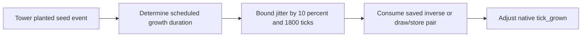

# Balanced agricultural growth jitter

## Admin repair

`repair_runtime_state` removes pending offsets only for towers absent from the world. Inverse balancing offsets for live tower/plant streams survive, and existing plant growth times are untouched.

## Implementation sources

- [randomized-tree-growth.lua](../../../exotic-space-industries-remembrance/scripts/control/randomized-tree-growth.lua)

## Ownership and reference flow

`storage.ei.randomized_tree_growth.pending_offsets_by_tower` holds the inverse offset waiting for each tower/plant-duration stream. Each planted entity retains native growth scheduling through `tick_grown`; no replacement growth loop is created.

## Tick flow and invariants

The planted-seed handler passes `event.tick` to duration and deadline calculations. It prefers the remaining scheduled duration, falling back to prototype growth ticks. Growth never schedules earlier than event tick plus one. A tower/plant/bound stream alternates a random offset and its inverse, preventing systematic pairwise throughput drift before the deadline clamp; missing tower identity uses a single bounded random offset.

## Lifecycle and cleanup

Init/configuration ensures the storage table. Destroying a tower removes its pending inverse streams. Invalid plants, unsupported/missing growth timing, and bounds below one tick return without a change. Save/load preserves the pending half-pair. Keep stream identity tied to both plant name and effective bound so different growth durations do not consume one another's offsets.

## Verification contract

Test paired offsets, interleaved plant streams, short and long growth durations, absent prototype timing, missing tower identity, deadline clamping, tower removal, and reload between a pair. Check native deadlines rather than adding a polling observer. This source model reports no new engine run.
