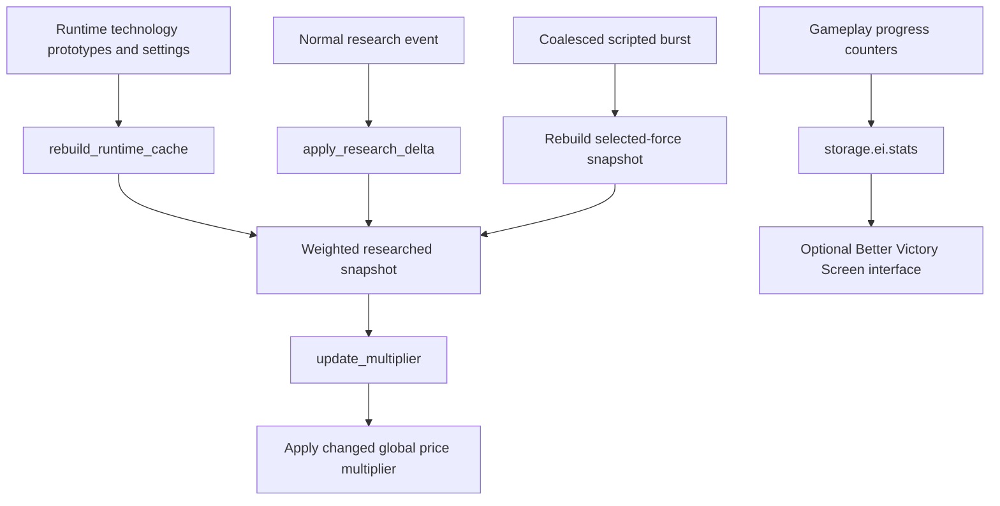

# Research scaling, progression migrations, and victory

## Admin repair

Victory `repair_runtime_state` restores optional victory integration callbacks without clearing completion flags or accumulated statistics. Intentional `victory_reset` remains a separate explicit gameplay action.

## Implementation sources

- [tech-scaling.lua](../../../exotic-space-industries-remembrance/scripts/control/tech-scaling.lua)
- [tech-weighting.lua](../../../exotic-space-industries-remembrance/lib/tech-weighting.lua)
- [tech-scaling-common.lua](../../../exotic-space-industries-remembrance/lib/tech-scaling-common.lua)
- [tech-scaling-shared.lua](../../../exotic-space-industries-remembrance/lib/tech-scaling-shared.lua)
- [victory-disabler.lua](../../../exotic-space-industries-remembrance/scripts/control/victory-disabler.lua)
- [1.3.35.lua](../../../exotic-space-industries-remembrance/migrations/1.3.35.lua)
- [1.3.36.lua](../../../exotic-space-industries-remembrance/migrations/1.3.36.lua)

## Behavior and ownership

`tech-scaling` computes a shared research-price multiplier from weighted completed technology and configured curves. `storage.ei.tech_scaling` owns static metadata, total/age weights, the selected-force researched snapshot, cached settings, and the last applied multiplier. `tech-weighting` excludes unsuitable technologies and supplies thematic weights; the two scaling libraries share price normalization and curve math with other stages.

The implementation deliberately selects `game.forces.player` or the first force. Its snapshot and application are not a general per-force economy. Preserve that limitation rather than silently treating the force argument of a burst receiver as independent multi-force support.

## Invariants and interfaces

`init` rebuilds settings/prototype metadata and applies the multiplier. `on_research_finished` filters to the selected force, applies a previously unapplied relevant delta, and falls back to rebuilding the researched snapshot or full cache when necessary. Ignored/repeated completions do not increment totals again. `on_scripted_research_burst` refreshes once from the selected force's actual researched state. Age-ramp and the other configured curves use the same cached totals and normalized base-price assumptions; keep runtime/data consumers aligned when changing shared math.

`victory_disabler.init` disables native victory through available remote interfaces. `count_value` and `return_value` maintain `storage.ei.stats`; `add_interface` optionally exposes `exotic-industries-bvs` and currently reports the statistics under the player-force key. This module exposes bookkeeping, not a new victory detector.

## Tick flow

The scaling calculation does not need its own clock or periodic service. Normal research and scripted bursts reach it through the coordinator. Burst due ticks, ordering, and per-force coalescing belong to that coordinator; do not add a second delay queue here. If new time-sensitive research effects are added, pass the coordinator's current tick into the receiver.

## Lifecycle and migration contract

Init/configuration refresh the scaling caches; `refresh_tech_scaling` is the explicit repair command. Native and scripted research paths must both maintain derived state.

Migration `1.3.35.lua` moves the old repeatable electric-weapons tier-four progression into a finite tier-four gate plus repeatable tier five. It preserves completed levels, active/saved progress, and queued research where the API permits. Migration `1.3.36.lua` grants the replacement pump technologies/recipes from prior progress and rotates existing steam assemblers and ghosts to preserve world-space fluid hookups after the port change. These are upgrade-only repair actions, not recurring runtime work; do not replay their world mutations from periodic sanity checks.

## Verification and limits

The [scripted research QC helper](../../skills/esir-dev/references/scripted-research-qc-helper.md) and [research hitch helper](../../skills/esir-dev/references/research-hitch-qc-helper.md) expose burst behavior and cache results. They do not replace normal one-tech completion coverage or migration fixtures.

Verify a normal delta, repeated notification, scripted flood, disabled scaling, each configured curve, ignored secondary-force research, cache rebuild, queued/active electric-weapons migration, pump unlock preservation, and steam-assembler/ghost port preservation. No fresh migration or engine results are claimed by this source-derived model.
