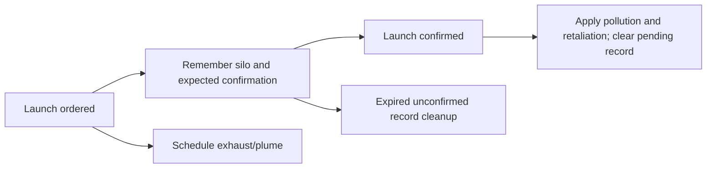

# Rocket launch consequences and visual scheduling

## Admin repair

`repair_runtime_state` normalizes pending-launch state and recomputes smoke/cleanup summaries. It never reapplies confirmed pollution or replaces queued effect jobs.

## Implementation sources

- [rocket-launch-pollution.lua](../../../exotic-space-industries-remembrance/scripts/control/rocket-launch-pollution.lua)

## Ownership and reference flow

`storage.ei.rocket_launch_pollution` owns pollution-curve configuration, per-silo pending launches, delayed cleanup, and budgeted plume/spiral jobs. Ordered launch timing owns visuals; confirmed launch timing owns pollution and retaliation.

## Tick flow and invariants

Impossible-difficulty retaliation respects the surface's native peaceful and no-enemies modes before selecting units or issuing commands. Launch pollution and visual scheduling remain independent of this native enemy policy.

Both launch events propagate `event.tick`. The gated every-tick updater services only due visual and cleanup work. Preserve smoke budgets and lifetime advancement when skipping emission ticks. Status/utility helpers may fall back to `game.tick`; this does not justify replacing event timestamps. Consequences must not fire merely because an ordered launch reached its predicted tick.

## Lifecycle and cleanup

Pending records are keyed by silo identity, with surface/position captured for later work. Confirmed launches consume their pending record; if a record was lost during migration or external interference, confirmation computes a fallback consequence. A new visual sequence clears conflicting jobs for the same silo. Stale pending cleanup and invalid surface/entity checks keep abandoned visual work bounded.

## Verification contract

Test Impossible retaliation on ordinary, peaceful, and no-enemies surfaces, including existing units. Test delayed and cancelled launches, destroyed silos, confirmed launches with/without an ordered record, repeated launches, multiple surfaces, each visual style, and save/reload with pending jobs. Check consequence counts separately from smoke appearance and scheduler timing. This model makes no new claim that every launch scenario has been engine-tested.
