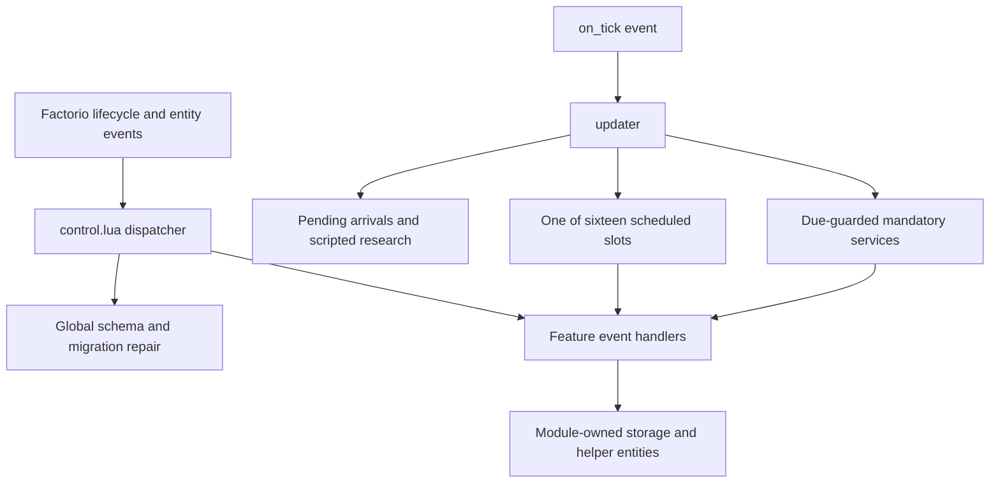

# Runtime orchestration and registry ownership

## Implementation sources

- [control.lua](../../../exotic-space-industries-remembrance/control.lua)
- [global.lua](../../../exotic-space-industries-remembrance/scripts/control/global.lua)
- [register-util.lua](../../../exotic-space-industries-remembrance/scripts/control/register-util.lua)

## Behavior and boundaries

`control.lua` owns Factorio event registrations and dispatch order. Feature modules own gameplay state and local service decisions. `ei_global.init` seeds `storage.ei`; `ei_global.check_init` fills missing or older structures without replacing valid feature state. `register-util` supplies fluid registration, collector registration, update counts, and legacy master/slave bookkeeping; it is not an independent scheduler.

`on_built_entity`, `on_cloned_entity`, `on_destroyed_entity`, tile handlers, filtered script effects, research handlers, and GUI handlers forward into the appropriate systems. GUI routing uses valid elements/entities and stable parent tags. Registration filters and handler order are part of the contract: adding one receiver must not displace another owner of the same event.

Water-turret GUI opens and closes use entity ownership or an existing player session, so unrelated events still clear stale relative panels. Widget changes use exclusive parent-tag branches. Entity wrappers validate before feature fan-out; clone helper cleanup runs before the spider transaction guard and revalidates the destination before shared clone setup. Force, research, blueprint and object-destruction callbacks remain shared fan-out.

## Tick flow and scheduler contract

`updater(event)` chooses `(event.tick % ei_update_functions_length) + 1`, currently sixteen slots. `ei_ticksPerFullUpdate` affects the budget divisor; it does not replace this sixteen-tick slot rotation. Budgeted branches use the pending workload, `ceil(work/divisor)`, and `ei_maxEntityUpdates`; several recheck workload after each item and jump to `skip` when the lane is exhausted. The `skip` label still runs the mandatory tier.

| Slot | Owner |
|---|---|
| 1 | Global sanity, fumarole schema, due Nauvis grace/campfires/Gaia reforge |
| 2–4 | Fluid safety, neutron collectors, matter stabilizers |
| 5–7 | Orbital combinators, fuelers, gates |
| 8–10 | EM trains, EM chargers, orbital logistics |
| 11–13 | Railgun cooling, crystal surface resonance, Singularity Lance |
| 14–16 | Fusion telemetry/control, Emerald Apocalypse, flamethrower fuel replacement |

Water-turret service precedes the scheduled tier. Arrivals and due scripted research also flush before the selected lane. Mandatory services are guarded by module work predicates; Lance and Emerald carry per-tick flags so their scheduled and mandatory paths do not double-service the same work. Emerald hot presentation remains a separate path. The periodic telemetry heartbeat is currently commented out, not an active 600-tick registration.

Use the original callback tick through downstream work. Water-turret rebuilds receive one `game.tick` snapshot at each init/configuration boundary. Other init/configuration callers are not uniform: some still use `event and event.tick or 0`. These are existing boundary call sites, not evidence that every lifecycle callback supplies a tick; this model does not claim they have been repaired.

## Lifecycle and cross-system state

New-save initialization creates shared storage before feature rebuilds, then synchronizes compatibility, victory, settings, and arrival work. Configuration changes repair global storage and clear the pending scripted-research burst state, invalidate derived due minima, and perform both unconditional and mod-change-gated feature rebuilds. Preserve those distinctions: migration-only loads still rebuild systems with unconditional repair.

`on_load` currently invokes only the Tesla module's local-load hook. Arrival gameplay resumes from player entry/controller events and `on_singleplayer_init`, not from load-time world mutation.

`storage.ei.scripted_research_burst` owns `pending_by_force`, `due_buckets`, and `next_due_tick`. `queue_scripted_research_burst` coalesces scripted completions per force until after the latest source tick. Old bucket entries may remain, so flushing deduplicates force IDs and validates the live pending entry. Normal research flushes that force's pending burst first. Burst consumers refresh force-derived state; they must not assume one representative technology describes the whole batch.

Shared registries are paired: fluid insertion/removal adjusts membership and counts; master/slave setup and teardown maintain both directions and destroy owned helpers where requested. Serialized LuaEntity references need renewed validity checks at consumption. Do not revive dormant beacon scaffolding simply because generic registry support exists.

## Verification and limits

Use the checked-in [control lifecycle driver](../../../scripts/invoke-control-lifecycle-qc.ps1) and [queue-save fixture](../../../scripts/qc/control-ups/queue-save.lua) for queue continuation across save/load and configuration repair; the [GUI lifecycle fixture](../../../scripts/qc/control-ups/gui-lifecycle.lua) covers routed GUI transitions. The [scripted research helper](../../skills/esir-dev/references/scripted-research-qc-helper.md) exercises burst fan-out separately from normal research.

Acceptance must preserve slot order, derived budgets, actual service ticks, no-work guards, ordinary research, scripted floods, GUI closure, entity removal, and save/load continuation. These are available verification surfaces, not a claim of a fresh engine or multiplayer pass for this documentation rollout.
