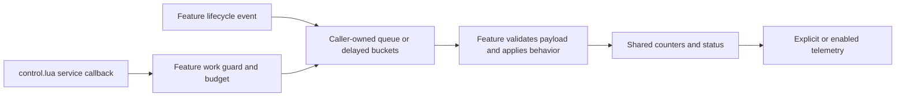

# Shared runtime scheduler

## Implementation sources

- [runtime-scheduler.lua](../../../exotic-space-industries-remembrance/lib/runtime-scheduler.lua)

## Behavior and ownership

`queue_peek_last` reads the final non-nil stored FIFO value without removing it or
touching uniqueness membership. Domain/membership liveness belongs to the caller.
Sparse canceled tails may require a backward walk; owners
such as the lance cache their tail on admission and use this helper for migration
or lifecycle repair, not every shot.

`scheduler` provides queue operations, delayed buckets, counters, status snapshots, and optional telemetry. It registers no events and owns no gameplay cadence. Feature queues and bucket tables belong to their callers; only status/counter/telemetry records live beneath `storage.ei.runtime_scheduler`.

## Queue and due-work invariants

`ensure_queue` normalizes `items`, `head`, `tail`, and `queued`. `queue_length` is the index span; `queue_item_count` counts non-nil entries, so neither should silently replace the other in a budget calculation. `audit_queue` reports both, plus holes and unique membership.

`queue_push_unique` uses an explicit membership key, which may differ from the payload. `queue_pop(queue, unique_key)` can clear that explicit key. `queue_pop_queued` treats `queued[value]` as the live set, while `queue_pop_matching` consumes stale candidates until its predicate accepts one. Preserve the owner's membership representation when choosing a helper. Compaction retains remaining item order and does not redefine domain liveness.

`delayed_take_due` consumes only the exact tick bucket. `delayed_take_due_through` consumes all nonempty buckets through the supplied tick, sorted by due tick and then insertion order. A caller that can skip ticks needs the latter or an equivalent explicit catch-up policy. `delayed_next_due_tick` returns the earliest nonempty bucket or `false` for known emptiness; do not confuse that sentinel with an uninitialized cache.

## Tick flow

Queue and bucket operations use caller-supplied values and ticks. The feature should pass its callback's `event.tick` rather than obtain a second clock value. The current observational APIs—`bump_counter`, `set_module_status`, `status_snapshot`, and `write_telemetry`—stamp records with private `now_tick()`, which reads `game.tick` when available. They currently expose no tick parameter. This is an existing interface limitation, not an instruction to add more hidden clock reads.

## Lifecycle and failure boundaries

`ensure_root` creates the scheduler root and schema version, module records, and telemetry configuration; telemetry defaults to disabled. Even a status getter may initialize state, so these APIs are not safe substitutes for read-only `on_load` rebinding. `status_snapshot` references the current module/counter/telemetry tables; it is not a deep immutable snapshot.

Queues are payload-agnostic. They do not validate LuaEntity handles, remove helper entities, enforce a feature's fairness policy, or bound total backlog. Those obligations remain with the caller. `clear_queue` resets queue state; feature teardown must separately release domain objects and registrations.

`write_telemetry` ordinarily requires the enable flag; explicit forced snapshots may bypass it. `log_snapshot` is an intentional diagnostic operation. Do not add a periodic writer merely because the helper exists.

## Verification and limits

The [scheduler guidance](../../skills/esir-dev/references/runtime-scheduler-guidelines.md) defines reuse policy; keep it synchronized with interface changes. The [control queue lifecycle fixture](../../../scripts/qc/control-ups/queue-save.lua) and [lifecycle checker](../../../scripts/qc/control-ups/check-lifecycle.py) supply regression entrypoints.

Verify sparse queues, unique-key cleanup, stale membership rejection, stable compaction order, exact versus overdue buckets, empty due minima, save/load continuation, and disabled telemetry. Source inspection establishes these contracts; no new engine run or standalone helper test result is asserted here.
