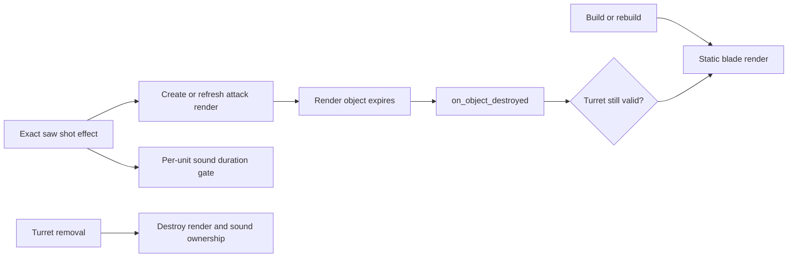

# Sawblade event-owned animation and sound gates

## Implementation sources

- [sawblade-turret.lua](../../../exotic-space-industries-remembrance/scripts/control/sawblade-turret.lua)

## Ownership and behavior

The Oathbreaker Saw runtime owns the blade overlay and attack-sound gate, while native prototype attacks own combat. `storage.ei.sawblade_turret` schema 5 holds entity handles, one blade render/mode per turret, render-destruction registrations, and per-unit sound deadlines/last variant. No steady polling loop exists.

## Tick flow and deadlines

The exact effect `ei-sawblade-turret-shot` supplies `event.tick` for 64-frame phase and sound gating. Attack render TTL is 45 ticks and repeated hits refresh the current attack handle. The sound gate uses chosen clip duration plus six ticks so frequent native damage pulses do not stack full sound clips. Expiration is an engine render-destruction event, not a manually polled timer. The event adapter's existing missing-tick default is zero; real dispatcher events provide the tick.

## Lifecycle and invariants

Configuration rebuild destroys old render handles before replacing state and rediscovers live turrets. Ordinary build adds the static render; removal clears render and sound ownership. A render-destroyed callback maps its registration back to the owner, clears obsolete maps, and restores static artwork only for a still-valid turret when the expired mode was attack. Preserve registration cleanup when refreshing/replacing renders to avoid duplicate overlays and stale callbacks. Runtime does not own targeting, ammunition, or damage.

## Verification and maintenance

Source inspection only; no dedicated sawblade runner was found in the targeted QC inventory. Use a focused runtime scenario for idle build, sustained firing, cessation restoring static art, removal during spin, ordinary reload and configuration rebuild. Visual/audio verification must check one blade layer and nonoverlapping clip gates; a headless runtime smoke only establishes lifecycle execution.
