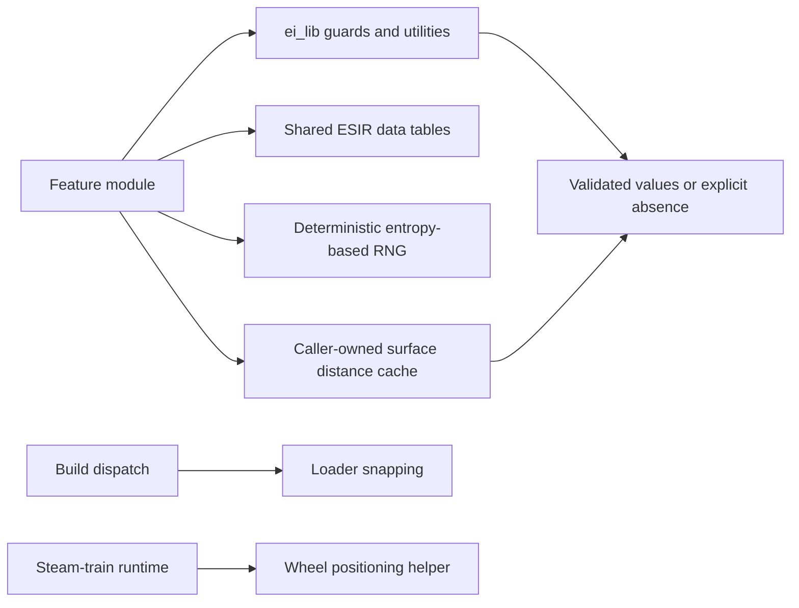

# Shared runtime helper boundaries

## Implementation sources

- [lib.lua](../../../exotic-space-industries-remembrance/lib/lib.lua)
- [data.lua](../../../exotic-space-industries-remembrance/lib/data.lua)
- [rng.lua](../../../exotic-space-industries-remembrance/lib/rng.lua)
- [loaders.lua](../../../exotic-space-industries-remembrance/lib/loaders.lua)
- [surface-anchor.lua](../../../exotic-space-industries-remembrance/lib/surface-anchor.lua)
- [handle-wheels.lua](../../../exotic-space-industries-remembrance/lib/handle-wheels.lua)

## Behavior and stage boundaries

These modules share utility behavior without owning a common runtime loop. `lib/lib.lua` contains both prototype mutation and runtime utilities; `lib/data.lua` supplies shared ESIR names, tables, and values. Importing a mixed-stage library does not make every exported function valid in the caller's stage. Runtime code must select helpers whose dependencies are available there.

## Ownership and invariants

- `ei_lib.entity_check`, `get_valid_entity`, and `get_entity_unit_number` normalize uncertain runtime handles. A successful key extraction is not an enduring validity guarantee; revalidate after delays or destructive callbacks.
- `ei_rng.int` and `ei_rng.float` construct a fresh deterministic seed from the caller's name and entropy inputs. There is no serialized generator state. Preserve stable entropy and ordering when changing callers. Current `float` returns the normalized LCG value directly despite accepting minimum/maximum arguments; do not infer scaled-range behavior from the signature.
- `ei_loaders_lib.on_built_entity`, `snap_loader`, `snap_belt`, and `attempt_snap` derive orientation/type from adjacent entities at build-time. `make_loader` and `addEnergyDraw` are prototype helpers and do not belong in runtime mutation paths.
- `surface_anchor.build_distance_cache` builds positions and pair distances from space locations; the consuming gate/crystal runtime owns the cache. `get_surface_universe_position` interpolates a travelling platform, otherwise resolves its current/last location, planet, or known surface name. Unknown anchors remain nil. `ensure_distance_cache` repairs structure; owners must explicitly invalidate stale prototype-derived contents.
- `handle-wheels` creates base and elevated wheel entities, aligns the active helper to the locomotive selection-box center, and hides the opposite helper at a remote position. Intermediate rail height hides both. It validates live handles during positioning but does not own tracking, ticking, or destruction; the steam-train module owns those lifecycle obligations.

## Tick flow

These helpers do not register tick callbacks. Timed feature work passes `event.tick` or a previously captured numeric tick through the owning module. Existing `ei_lib.get_event_tick` accepts a number, returns a table's tick, and otherwise returns zero; it does not read the current clock and does not prove an unticked lifecycle callback occurred at tick zero. Do not add local clock wrappers or treat this normalizer as a substitute for establishing the real boundary context.

## Lifecycle and compatibility

Shared data/constants survive through normal module reloading rather than persisted Lua locals. Entity and surface caches belong to consumers and must be rebuilt or invalidated through those consumers' configuration and destruction paths. Wheel helper cleanup belongs to steam-train teardown. Loader snapping acts on the current world rather than maintaining another persistent index.

Helper behavior changes affect runtime and potentially data-stage users. Search all callers before modifying defaults, return shapes, stage guards, RNG outputs, or geometry. Preserve existing shared interfaces unless a coordinated migration is part of the change. Follow the [runtime development standards](../../skills/esir-dev/references/runtime-development-standards.md): ordinary module calls use dots, intentional self methods such as wheel helpers retain colons, and reuse must preserve mutation/allocation semantics rather than mechanically replace read-only probes.

## Verification and limits

Use [ESIR lib-first guidance](../../skills/esir-lib-first/SKILL.md) and [Factorio stage assumptions](../../skills/factorio-lua-assumptions/SKILL.md) before extending this surface. Run the repository preflight plus the affected consumer's focused fixture; the [control lifecycle driver](../../../scripts/invoke-control-lifecycle-qc.ps1) can exercise consumer reconstruction.

Check invalid handles, nil anchors, platform movement, configuration cache rebuild, loader direction/type, and base/elevated/ramp wheel visibility in the relevant consumers. No single fixture proves all mixed-stage exports; the documentation rollout does not claim comprehensive behavioral validation of this large utility surface.
