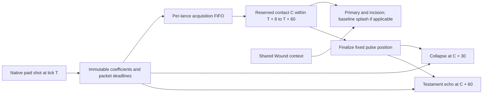

# Singularity Lance paid contacts, Wound context, and delayed pulses

## Implementation sources

- [singularity-lance.lua](../../../exotic-space-industries-remembrance/scripts/control/singularity-lance.lua)
- [singularity-lance-config.lua](../../../exotic-space-industries-remembrance/lib/singularity-lance-config.lua)

## Ownership and behavior

This is the current schema-14 angular-sweep model. Repository-root `docs/singularity-lance.md` is the detailed mechanics/maintenance contract; `lib/singularity-lance-config.lua` remains the numerical authority for prototypes, paid snapshots, localization and presentation. Do not reconstruct older timing from historical QC reports.

Native firing pays energy and emits exactly `ei-singularity-lance-shot`; admission snapshots one paid transaction and all applicable deadlines. `storage.ei.singularity_lance` owns registered lances, force capabilities, mechanical delayed packets, per-lance FIFO contact waypoints, shared Wound contexts and presentation handles. Damage is independent of visual fidelity and decorative budgets.

## Tick flow and deadlines

All deadlines are fixed at firing: angle-dependent contact C; collapse C+30; Testament echo C+60. Arrival does not enqueue new damage deadlines. `event.tick` drives admission/service; eventless init/config/status boundaries retain fallback. Step 13 is opportunistic: preserve the every-tick fallback and serviced-this-tick guard. Queued paid shots remain separate, in due/insertion order; only presentation may coalesce.

Admission uses queued planned aim and cached tail deadline P, or the last logical contact heading when empty. For tick T, nominal D=max(8,ceil(angle/6)); retarget reserves min(T+60,max(T+8,P+1,max(T,P)+D)). Same valid non-null target/force/surface omits the D term. First acquisition takes eight ticks. Old reservations beyond a newly reduced cap are grandfathered, never overtaken. Synthetic saturation may share due ticks while preserving insertion order. Logical aim and tail never depend on beam handles or cosmetic rebuilds.

Presentation rotates about shared crystal offset (0,-3.35), interpolating radius separately with smoothstep. Shortest arc, clockwise 180-degree ties, continuously unwrapped moving bearings; target movement never extends the deadline. Only active FIFO heads are tracked. Reuse one native main beam plus three extensions, retracting extensions during acquisition. No afterimage stack or idle tracking.

Middle/end terrain lighting samples the beam artwork's six saturated ribbon colors when a native beam needs creating. Keep that color through endpoint moves; contact flash/afterglow match the main endpoint. The crystal-side tail stays violet. A lazily created, saved `light_random` generator belongs only to presentation and never consumes gameplay RNG; it adds no scheduler work or entity handles. Palette prototype variants reuse existing masks/artwork and preserve fidelity scaling and finite light lifetimes.

Wound advances on positive primary damage only: the first hit is unmodified, the second gains +20%, and the sixth reaches +100%. Each earned stack prepares the next contact; the five-stack halo signals that the next hit is ready for +100%. It uses a 120-contact-tick inclusive expiry boundary and shares context among shots paid before earlier contacts land. The first-hit policy is snapshotted at payment; older queued contacts retain their original first-hit bonus. Testament counts every eighth paid shot even if its primary later disappears. Targets may move during acquisition; contact finalizes geometry before damage callbacks, then pulses remain fixed.

## Lifecycle and invariants

Source removal clears live registrations/cues but preserves paid damage. Loss of Wound capability, source removal, or ownership changes detach the live Wound context; already-paid contacts retain their snapshotted coefficients and shared context. Research changes that retain Wound capability preserve the live context. Surface clear/deletion cancels only matching packets/FIFO entries; force merge transfers attribution. Friendship/cease-fire in either direction, same force, and neutral ownership protect targets, rechecked immediately before every damage call. Revalidate entities and live context after callbacks before rendering or publishing state. Ordinary save/load preserves meters, contexts and packets; idle lances do not search or sweep wounds.

## Verification and maintenance

Reuse current-source modes in `scripts/invoke-singularity-lance-qc.ps1` and `scripts/qc/singularity-lance/README.md`; distinguish angular evidence from historical schema-13 reports. Test polar geometry/angle wrapping, timing/queue compression, separate resistance packets, contact-relative pulses, target death/movement, Wound reset/zero damage, source removal, surface cancellation, force/research changes and actual save/reload. The explicit 11/12/13/14 migration chain preserves old paid work; schema-13 contacts retain legacy interpolation. The generic event-tick fixture explicitly has no targeted Lance checks.
