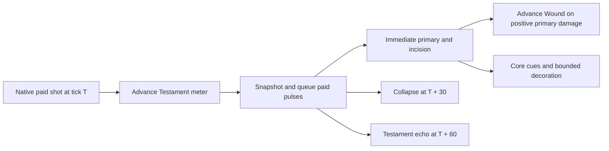

# Singularity Lance paid shots, Wound meters, and delayed pulses

## Implementation sources

- [singularity-lance.lua](../../../exotic-space-industries-remembrance/scripts/control/singularity-lance.lua)
- [singularity-lance-config.lua](../../../exotic-space-industries-remembrance/lib/singularity-lance-config.lua)

## Ownership and behavior

The implemented runtime uses schema 12. `lib/singularity-lance-config.lua` owns
mechanical coefficients, upgrade descriptions, and presentation presets.
Native firing pays energy and emits exactly `ei-singularity-lance-shot`.
`lance.on_script_trigger_effect` consumes that paid shot, snapshots delayed
damage, applies the immediate primary and incision packets, and then presents
the result. Visual fidelity and decoration budgets never govern damage.

`storage.ei.singularity_lance` owns registered lances, object registrations,
force capability caches, per-lance Testament counters and Wound state, delayed
collapse/echo buckets, the derived next-due tick, and presentation handles.
The current implementation has no acquisition FIFO or delayed primary contact.

## Tick flow and deadlines

The shot callback supplies `event.tick`; primary damage occurs during that
callback. Collapse and Testament echo deadlines are fixed at firing, currently
+30 and +60 ticks. Their aim and coefficients are snapshotted before immediate
damage can invoke callbacks that change research, ownership, or source validity.
`lance.update` takes due buckets through its supplied execution tick. Step 13
is opportunistic; preserve the dispatcher's every-tick due-work fallback and
serviced-this-tick guard. Separate paid packets retain separate resistance
applications. Status/rebuild helpers use supplied ticks when available and
resolve existing `game.tick` fallbacks at unticked boundaries.

Wound is per lance and target: positive primary damage builds/refreshes it;
zero damage does neither. Changing target, losing hostility or capability,
or reaching an elapsed interval of at least 120 ticks resets the meter.
Testament counts every eighth paid shot before target validation. These timing
rules describe implemented behavior, not a pending sweep design.

## Lifecycle and invariants

Source removal clears the registration and live cues but leaves paid delayed
damage intact. Surface clear/deletion removes that surface's records and
packets and recomputes the next due tick. Force merge transfers delayed packet
attribution, resets live meters/cues, and refreshes capabilities. Research
refresh clears Wound when capability falls below its required level and resets
the Testament counter when its capability is lost. Friendship or cease-fire in
either direction, same force, and neutral ownership protect targets; hostility
is rechecked immediately before damage. Revalidate entities after damage
callbacks before rendering.

Initialization/configuration performs discovery and repairs presentation while
preserving current paid packets and deadlines. Schema 11 upgrades in place:
existing packets remain legacy packets and gain neither stronger core damage
nor echoes. Older unsupported schemas use `settle_legacy` to settle pending
primary payloads once. Ordinary save/load preserves serialized meters and
queues; idle lances do not search or sweep wounds.

## Verification and limits

Use the [Lance QC driver](../../../scripts/invoke-singularity-lance-qc.ps1) and
[fixture guidance](../../../scripts/qc/singularity-lance/README.md). Cover
separate resistance packets, fixed +30/+60 deadlines, Wound's expiry boundary,
zero-damage hits, source removal, surface cancellation, force/research changes,
legacy schema repair, and save/reload continuation. This model was reviewed
against its source; cited historical reports are not a fresh engine,
multiplayer, or performance pass for the blueprint commit.
