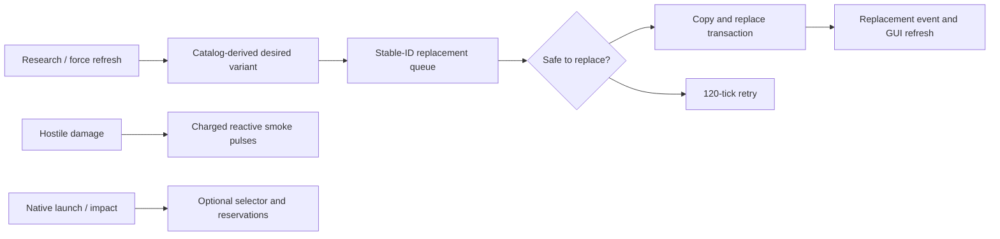

# Spider progression, safe replacement, weapon controls, and reactive smoke

## Implementation sources

- [spider-vehicles.lua](../../../exotic-space-industries-remembrance/scripts/control/spider-vehicles.lua)
- [spidertron-limiter.lua](../../../exotic-space-industries-remembrance/scripts/control/spidertron-limiter.lua)
- [spider-vehicles.lua](../../../exotic-space-industries-remembrance/lib/spider-vehicles.lua)

## Ownership and behavior

The shared catalog defines scout/assault/rocket families, cumulative chassis/weapon progression, exact effect IDs, smoke timing, selector budgets, and compatibility proxy identity. Runtime owns `storage.ei.spider_vehicles`: stable vehicle IDs, current-unit and destruction maps, force profiles, replacement/retry/smoke queues, mined-item preferences, GUI sessions, selection caches, and native-shot reservations. The standalone limiter is event-only: manual logistics requests on `sp-spiderling` accept only fuel matching its burner categories.

`control.lua` owns event registrations and the `exotic-industries-spider-vehicles` remote interface. The module generates its replacement-event identifier at control load. Native guns/projectiles retain mechanical firing; optional range-aware selection and reservations observe native launch/impact rather than creating synthetic shots.

## Tick flow and budgets

The updater uses `event.tick` for exact retry/smoke buckets and downstream selection/reservation work. Replacement attempts cap at two per tick; unsafe attempts retry after 120 ticks. Smoke admission emits the first pulse immediately, followed by pulses at +60, +120, +180, +240, and +300 ticks; the catalog separately declares a 360-tick duration and an 1,800-tick cooldown. Optional selector refresh intervals are 15 active/60 idle ticks, with eight searches per tick. Reservation expiry is 300 ticks. Remote control entry points may supply a numeric tick and otherwise retain their existing eventless fallback.

## Lifecycle and invariants

Build/clone/mining/item destruction, research (including coalesced scripted bursts), forces, and external replacement keep stable identities/preferences synchronized. Configuration resets selector/reservation caches, grandfather-migrates only specified old unlocks, discovers world vehicles, and queues desired variants. The transaction guard prevents duplicate ownership during replacement. Compatibility boarding proxies suspend ESIR replacement; ordinary occupants transfer with the replacement transaction, while moving, temporary-effect, construction, and active-logistics states defer. Relative GUI tags identify stable records.

When range-aware cycling is disabled, exact observation hooks and selector service are absent while native behavior and reactive smoke remain. Compatibility proxy suspension and replacement handoff are ownership contracts, not dead code to simplify away.

## Verification and maintenance

Source inspection only. Use `scripts/invoke-spider-vehicles-qc.ps1` and `scripts/qc/spider-vehicles/README.md` for migration, replacement, controls, dispatch, reservations and persistence cases. Preserve inventory/equipment/burner/health/control data across replacement; verify deferred retries and zero selector counters in disabled mode. The limiter additionally needs mixed fuel categories, nonitem slots, and nonmanual sections.
