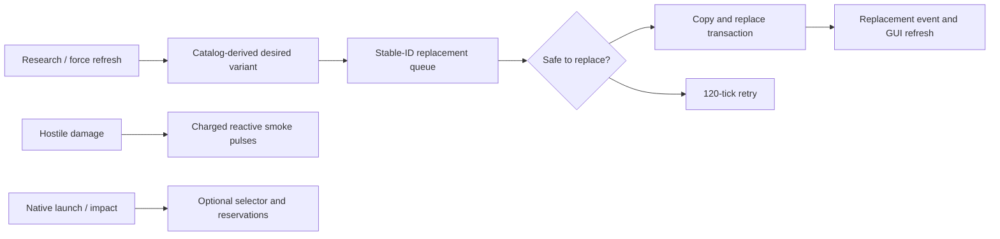

# Spider progression, safe replacement, weapon controls, and reactive smoke

## Admin repair

`repair_runtime_state` performs discovery and research-cache reconciliation independently of configuration migrations. It retains live stable identities, preferences, smoke cooldowns, ammunition reservations and pending work; no grandfather technology grants are replayed.

## Implementation sources

- [spider-vehicles.lua](../../../exotic-space-industries-remembrance/scripts/control/spider-vehicles.lua)
- [spidertron-limiter.lua](../../../exotic-space-industries-remembrance/scripts/control/spidertron-limiter.lua)
- [spider-vehicles.lua](../../../exotic-space-industries-remembrance/lib/spider-vehicles.lua)
- [spider-vehicles.lua](../../../exotic-space-industries-remembrance/prototypes/spider-vehicles.lua)

## Ownership and behavior

The shared catalog defines scout/assault/rocket families, cumulative chassis/weapon progression, exact effect IDs, smoke timing, selector budgets, and compatibility proxy identity. Runtime owns `storage.ei.spider_vehicles`: stable vehicle IDs, current-unit and destruction maps, force profiles, replacement/retry/smoke queues, mined-item preferences, GUI sessions, selection caches, and native-shot reservations. The standalone limiter is event-only: manual logistics requests on `sp-spiderling` accept only fuel matching its burner categories.

`control.lua` owns event registrations and the `exotic-industries-spider-vehicles` remote interface. The module generates its replacement-event identifier at control load. Native guns/projectiles retain mechanical firing; optional range-aware selection and reservations observe native launch/impact rather than creating synthetic shots.

## Tick flow and budgets

The updater uses `event.tick` for exact retry/smoke buckets and downstream selection/reservation work. Replacement attempts cap at two per tick; unsafe attempts retry after 120 ticks. Smoke admission emits the first pulse immediately, followed by pulses at +60, +120, +180, +240, and +300 ticks; the catalog separately declares a 360-tick duration and an 1,800-tick cooldown. Optional selector refresh intervals are 15 active/60 idle ticks, with eight searches per tick. Reservation expiry is 300 ticks. Remote control entry points may supply a numeric tick and otherwise retain their existing eventless fallback.

## Lifecycle and invariants

Build/clone/mining/item destruction, research (including coalesced scripted bursts), forces, and external replacement keep stable identities/preferences synchronized. Configuration resets selector/reservation caches, grandfather-migrates only specified old unlocks, discovers world vehicles, and queues desired variants. The transaction guard prevents duplicate ownership during replacement. Compatibility boarding proxies suspend ESIR replacement; ordinary occupants transfer with the replacement transaction, while moving, temporary-effect, construction, and active-logistics states defer. Relative GUI tags identify stable records.

When range-aware cycling is disabled, exact observation hooks and selector service are absent while native behavior and reactive smoke remain. Compatibility proxy suspension and replacement handoff are ownership contracts, not dead code to simplify away.

Central GUI routing accepts spider-vehicle entities or players with an existing session (`has_open_gui_session`), preserving stale-panel teardown and the module's transaction guard. Widget changes route exclusively by the spider console's parent tag; the handler may rebuild its source element.

## Canonical items and equipment handoff

Every gameplay variant mines to its family's public item. Each public item places a hidden maximum-grid transport body; these three bodies (and matching optional boarding proxies) are outside the 24,388 gameplay configurations. Explicit placement ingredients also let robots revive gameplay-variant ghosts with the canonical item. Old tier-specific items remain hidden and placeable, and normalize when mined again. The Gaian saucer has one selectable recipe using the public scout item; old alternative recipe IDs remain hidden for configured machines and receive no new research unlocks.

Factorio moves equipment from a consumed vehicle item into the entity only when grid prototype names match. During player or robot build events, runtime copies the consumed item into a temporary native inventory only when those names differ. A matching native swap can leave blueprint ghosts in the consumed item; these are not carried equipment to restore. The transport body is inactive, unmineable, inoperable, and indestructible until the existing replacement queue restores equipment and commits a researched gameplay body. A ghost may create a gameplay body directly; if its grid is too small for the snapshot, it first transitions through the transport body. Restored equipment fulfills matching blueprint ghosts while retaining additional native requests. The snapshot preserves quality, position, charge, shields, equipment ghosts, and equipment burner state; native item metadata and the existing transactional replacement preserve the remaining vehicle state and preferences.

If equipment exceeds the receiving force's researched grid, placement first commits a gameplay body with the carried grid tier. Capacity checks include quality bonuses and then defer the downgrade until equipment fits. No equipment is ejected and no permanent off-item equipment bank is introduced. Clones copy pending native snapshots; completion and record destruction dispose of them. No new event dispatcher, recurring scan, or scheduler is added.

## Verification and maintenance

Use `scripts/invoke-spider-vehicles-qc.ps1` and `scripts/qc/spider-vehicles/README.md` for migration, replacement, controls, dispatch, reservations and persistence cases. The focused `-CanonicalItems -SavePath <player-save>` mode covers native player/robot mining and rebuilding, all family/grid pairs, legacy items, quality-expanded grids, and safe downgrade deferral; it does not rerun combat or fleet benchmarks. Preserve inventory/equipment/burner/health/control data across replacement; verify deferred retries and zero selector counters in disabled mode. The limiter additionally needs mixed fuel categories, nonitem slots, and nonmanual sections.

## GUI refresh cost

Spider weapon panels retain their roots while the vehicle entity and ammo-slot layout remain unchanged. Dynamic controls and optional readouts use named elements, visibility changes, and a scalar displayed-state signature. Native vehicle replacement or a legacy layout rebuilds once. Pending retries and weapon-control events reuse the same panel; no GUI polling is introduced.
