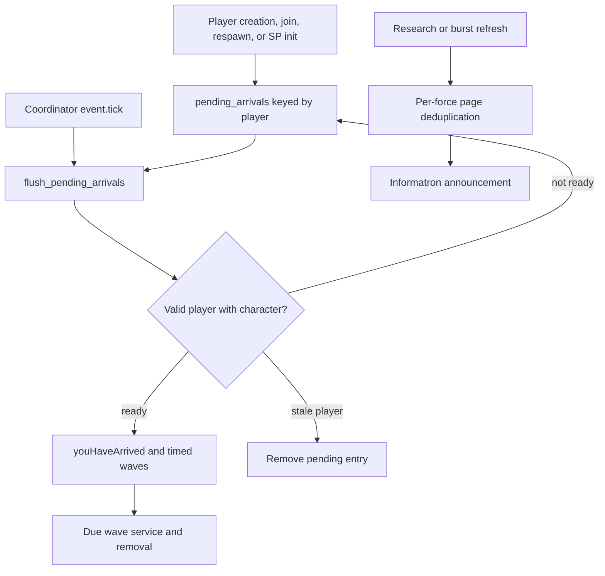

# Startup, compatibility, diagnostics, and information interfaces

## Admin repair

Arrival repair normalizes pending players and the saved wave due minimum without replaying arrival rewards/effects. Informatron notification repair prunes only nonexistent force ownership, retaining delivered-page history. Admin registry diagnostics remain separate from mutating legacy status getters.

## Implementation sources

- [echo-codex.lua](../../../exotic-space-industries-remembrance/lib/echo-codex.lua)
- [compat.lua](../../../exotic-space-industries-remembrance/scripts/control/compat.lua)
- [debug.lua](../../../exotic-space-industries-remembrance/scripts/control/debug.lua)
- [informatron.lua](../../../exotic-space-industries-remembrance/scripts/control/informatron.lua)
- [informatron-messager.lua](../../../exotic-space-industries-remembrance/scripts/control/informatron-messager.lua)
- [milestone-preset.lua](../../../exotic-space-industries-remembrance/scripts/control/milestone-preset.lua)

## Behavior and ownership

Informatron presents [Pyric Radiance and Ballistic Divergence](combat-doctrines.md#contract)
using shared stage-neutral configurations; these pages own no combat effects.
`compat.warn_combat_overlap` prints independent optional-counterpart warnings
through the [combat overlap contract](combat-doctrines.md#overlap) on native
singleplayer initialization and multiplayer join. Other player-entry hooks do
not repeat those warnings; disabled integrated features produce no warning.

This group owns presentation/integration boundaries, not feature mechanics. `echo-codex.handle_global_settings` synchronizes startup-derived runtime settings. Player entry queues the arrival ritual until a character exists. Informatron and Milestones expose stable remote interfaces; `informatron-messager` announces newly relevant pages. `compat` bridges optional mods and accepts Gaia-surface/beacon-overload overrides. `debug` exposes explicit diagnostic and repair commands.

## Interfaces and invariants

`storage.ei.pending_arrivals` deduplicates players; `arrival_waves` and `arrival_waves_next_due_tick` hold scheduled beam records and their derived minimum. `flush_pending_arrivals` drops nonexistent players, waits for character readiness, then calls `youHaveArrived` with the flush callback's current tick. The pending entry stores no original enqueue timestamp. Wave service removes completed beams and empty waves.

`storage.ei.informatron_messager.notified_by_force` stores announced pages by force index. Both `on_research_finished` and `on_scripted_research_burst` use the same deduplication path; the burst path inspects completed technologies instead of inventing one representative research event.

Remote names are `exotic-industries-informatron`, `exotic-industries-milestones`, and `exotic-industries`. The latter adds/clears `storage.gaia_surfaces` and modifies `storage.ei.beacon_overload.compat` exclusions/weights, then requests the owning beacon runtime to refresh. It does not directly own beacon topology. Optional startup integrations check mod/interface availability before calling K2 or DiscoScience. `compat.nth_tick` is an empty legacy function, not an active scheduler registration.

Diagnostic entrypoints include `ei_runtime_status`, `ei_orbital_scanner_probe`, `refresh_beacon_overload`, `rescan_orbital_logistics`, and `reforge_gaia`. Commands differ in authorization and side effects; do not assume every status-looking helper is pure or every command is read-only. Informatron pages should describe the owning config/runtime contract rather than create another set of gameplay constants.

## Tick flow

Arrival scheduling and waves use the coordinator's event tick. Pending readiness is checked by the coordinator's arrival flush; due wave service uses the stored minimum. Keep both event-supplied tick paths intact. Explicit command/remote diagnostics may have no gameplay event tick and use existing observational APIs; this does not justify replacing available callback ticks elsewhere.

## Lifecycle and cleanup

Settings synchronization occurs through init/configuration orchestration. Player-created/joined/cutscene/respawn hooks and singleplayer init enqueue work. No arrival gameplay should move into `on_load`. Invalid pending players are removed, and consumed wave records are deleted. Existing beam records contain surface references; changing surface lifecycle behavior requires checking that delayed presentation cannot dereference a removed surface.

Remote callbacks and command registration remain available after script reload through module loading, while persistent counters/queues live in storage. Newly added optional integration must preserve an absent-mod path. Page notification flags intentionally survive reload to avoid repeated announcements.

## Verification and limits

Use the [GUI lifecycle fixture](../../../scripts/qc/control-ups/gui-lifecycle.lua) and [control lifecycle driver](../../../scripts/invoke-control-lifecycle-qc.ps1) for entry/GUI transitions, and the [scripted research helper](../../skills/esir-dev/references/scripted-research-qc-helper.md) for notification fan-out. Inspect the real command callback before invoking it; Gaia reforge is destructive gameplay behavior.

Cover new-save entry, characterless player waiting, reconnect, SP reload, stale player removal, disabled optional dependencies, force page deduplication, compatibility override refresh, and delayed waves during surface changes. The current source review is not a fresh visual or multiplayer validation, and the cited fixtures do not prove every optional integration.
