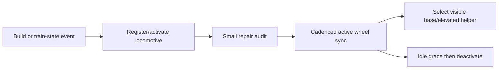

# Steam train wheel helpers

## Implementation sources

- [steam-train.lua](../../../exotic-space-industries-remembrance/scripts/control/steam-train.lua)

## Ownership and reference flow

`storage.ei.locomotives` owns an indexed set of steam locomotives, a smaller active set, and an audit cursor. Each locomotive owns base and elevated wheel helper entities. `handle-wheels.lua` supplies height-mode selection, alignment, hiding, and transform synchronization.

## Tick flow and invariants

The main every-tick path calls the module only when records exist. Each call performs a small audit; wheel transforms run at a configured interval clamped to 1-5 ticks using `event.tick`. A due transform pass walks the entire active set; the cadence bound is not a fixed per-tick entity budget. The helper itself needs entity geometry, not a clock. Preserve the distinction between all tracked units and active units; briefly stopped trains remain active for the existing grace passes.

## Lifecycle and cleanup

Build handling converts the placement entity as required and registers the resulting locomotive. Train-state changes wake relevant locomotives. Invalid/missing wheel helpers are repaired; destruction removes both helpers and all queue indices. Init/configuration rebuild clears stale wheel/placement artifacts from surfaces, then recreates helpers for live locomotives. Height transitions must not display both helper layers incorrectly.

## Verification contract

Test ground/elevated tracks and ramps, motion/reversal, brief/long stops, teleport/surface change, independently destroyed wheels, locomotive removal, and rebuild. Check helper counts and queue membership in runtime QC; inspect actual wheel alignment and visibility in game because headless validity checks cannot verify sprite placement.
The wheel utility is owned by [shared runtime helpers](shared-runtime-helpers.md#contract); this module owns its entities and lifecycle.
