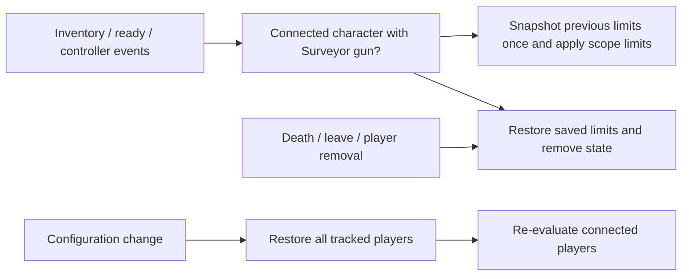

# Surveyor inventory scope and zoom restoration

## Implementation sources

- [surveyor-scope.lua](../../../exotic-space-industries-remembrance/scripts/control/surveyor-scope.lua)

## Ownership and behavior

This event-only feature enlarges character-controller zoom limits when a connected player carries a supported Surveyor weapon in the character gun inventory. It does not inspect current aiming or require the Surveyor gun to be selected. Supported identities are carbine, rifle, cannon and adaptive Surveyor. `storage.ei.surveyor_scope.players` stores whether the scope is active and the previously saved zoom-limit table.

## Tick flow and deadlines

No tick is required: there are no deadlines, queues or periodic scans. Player event adapters route `player_index` to `refresh_player`; inventing a tick parameter or polling cadence would add no information to this state transition. The configured furthest/furthest-game-view distances are 200 with maximum 240.

## Lifecycle and invariants

Applying an already-active scope preserves the original saved limits rather than overwriting them with scope limits. Loss of the gun, character controller, connection, or player validity triggers restoration/removal. Restoration retains state when setting limits fails, allowing retry; invalid missing players can simply lose their stored entry. Configuration first restores tracked active limits, clears those entries, then reevaluates connected players. The implementation uses copied tables and protected API calls around character inventory/zoom setters. Do not turn accepted temporary scope limits into permanent player defaults.

## Verification and maintenance

Source inspection only; no targeted Surveyor runner was found. Verify all supported gun names, a nonselected gun, main-inventory-only gun, removal of the last gun, controller switching, reconnect, death/respawn, configuration change while active, and restoration of nondefault preexisting limits. Interactive zoom behavior needs player validation beyond headless smoke.
