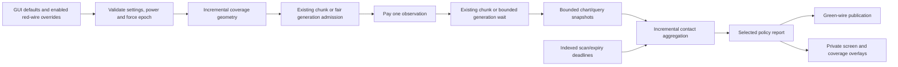

# Sweeping radar paid observations, quality, reports, and GUI

## Admin repair

`repair_runtime_state` prunes invalid owners, reconciles existing helpers, and discovers missing radar records. Existing manual geometry, paid jobs, output/contact buffers, trigger history and valid stored helper energy survive.

## Implementation sources

- [sweeping-radar.lua](../../../exotic-space-industries-remembrance/scripts/control/sweeping-radar.lua)
- [sweeping-radar-gui.lua](../../../exotic-space-industries-remembrance/scripts/control/sweeping-radar-gui.lua)
- [sweeping-radar-visuals.lua](../../../exotic-space-industries-remembrance/scripts/control/sweeping-radar-visuals.lua)
- [sweeping-radar-config.lua](../../../exotic-space-industries-remembrance/lib/sweeping-radar-config.lua)
- [sweeping-radar-geometry.lua](../../../exotic-space-industries-remembrance/lib/sweeping-radar-geometry.lua)
- [sweeping-radar-contacts.lua](../../../exotic-space-industries-remembrance/lib/sweeping-radar-contacts.lua)
- [sweeping-radar-timers.lua](../../../exotic-space-industries-remembrance/lib/sweeping-radar-timers.lua)

## Ownership and behavior

The two scripted radar chassis share one data/runtime config. `storage.ei.sweeping_radar` owns records, hidden electrical/output helpers, independent fair ready lists, paid observation jobs, deadlines, report/contact sets, temporary upgrade transfers, and nested GUI sessions. Native radar scanning/wireless coupling are disabled for these chassis; ordinary radar is outside this feature.

Geometry incrementally prepares chunk coverage; contacts maintain indexed expiry/nearest heaps of observed snapshots rather than live moving-target references. Timers use a feature-specific indexed heap because circuit changes require cancellation/rescheduling in place, which append-only shared delayed buckets do not express. Shared scheduler queues/status remain in use. Lane schema 3 separates ordinary observation visits from generation admission. Repository-root `scripts/qc/sweeping-radar/README.md` supplies the extended contract.

## Tick flow and budgets

Every-tick central dispatch passes `event.tick`. Config limits per tick are four control visits, 64 geometry operations, two observations, 64 aggregation records, 64 maintenance operations including deadline wakeups, two publications, and one GUI viewer. Control polling is at least ten ticks; GUI refresh at least 15, with opening delayed one tick. At most 32 observation jobs exist, at most 16 await generation, with one global generation request per 30 ticks and a 3,600-tick timeout.

An observation needing a new ungenerated chunk yields unpaid into the generation lane. Its admission cursor advances only when the time gate and global job limits permit a request; at most one admission turn consumes the first of the same two observation visits. This prevents fair ordinary visits from phase-locking against the 30-tick generation gate. Cancellation clears `generation_pending`, and bounded control service repopulates lanes after schema conversion.

Standby load is native; Lua debits only accepted observations once. Delayed service creates no elapsed-time catch-up debt. Each radar has one pending job/batch. Candidate query limit 129 provides a sentinel for 128 retained snapshots; contact sets cap at 2,048. Quality changes capability without changing any global budget or contact limit.

## Power and quality contract

Shared config owns hardware, research, quality anchors and the capability revision. Sweeping hardware uses 1 MW standby, 8 MJ per observation, 64 MW input and a 16 MJ buffer; Phased-array uses 2 MW, 5 MJ, 128 MW and 10 MJ. Both hidden buffers remain Normal quality. Standby continues while paused or armed. Charging limits are not continuous operating demand.

Quality levels 0/1/2/3/5 add 0/1/2/3/4 chunks, multiply requested rate by 1/1.10/1.20/1.35/1.50, and multiply observation energy by 1/.95/.90/.85/.80. Intermediate levels interpolate between these fixed anchors, rounding range down; levels outside the anchors clamp. Additional installed tiers never rescale existing bonuses. Native quality health remains enabled.

Each record caches quality level/bonuses, effective maximum/rate/cost, `capability_revision` and the helper's `power_revision`. Bounded control service refreshes these after registration, quality/research/force changes or a configuration revision. Electric interfaces retain serialized electrical settings when their prototype changes, so a stale power revision replaces only that helper and transfers its existing joules up to the new capacity. Fresh and repaired helpers start empty. Maximum radius is chassis + research + quality; rate and cost multiply their independent factors. Saved manual geometry remains authoritative: the default stays 12 chunks and better capability never expands a selected scan. Field metadata permits outer radius 36 and inner radius 35, but effective outer range still clamps to the individual radar and an invalid inner/outer pair pauses.

With all research and Legendary quality, Sweeping reaches 28 chunks, 6 observations/s and 4.48 MJ/observation; Phased-array reaches 36 chunks, 24/s and 2.8 MJ. Their requested full-speed demand is 27.88/69.2 MW if that throughput is achieved. GUI displays quality bonuses, effective maximum, selected-speed requested capacity, achieved throughput, observation cost, native standby, charging/buffer limits and estimated draw separately.

## Lifecycle and invariants

Build/clone/object destruction/teleport/settings paste/blueprint events maintain helpers/preferences. Research or diplomacy changes increment the force epoch; normal bounded control service reconciles records. Initialization/configuration may discover world chassis using an explicit boundary tick; ordinary reload resumes saved jobs/cursors. Upgrades transfer existing stored energy capped by the destination buffer, while copied/repaired helpers start empty. Expanding buffer prototypes preserves joules rather than filling the added capacity. Explicit pause/freeze/invalid input cancels unfinished paid work without refund. A changed capability signature also invalidates unfinished work; it never recharges an old paid job at the new price.

Only the selected reporting policy runs. Buffer publication/retirement is atomic/incremental; recent reports remain invalid while aggregation/overdue expiry is pending. Preserve trigger-edge history across geometry changes and latch pulse acknowledgement through a circuit publication. GUI teardown checks entity, force, surface, connection and opened-root identity.

Central GUI routing uses the two chassis names or `has_open_gui_session`, which includes queued opens as well as viewers. An unrelated open must still cancel a pending delayed screen. Close routing uses the radar screen element; widget events use its parent tag. Clone routing includes hidden output/power helpers and revalidates the destination after their cleanup.

## Scripted entity art

Placement/depth correction: item placement now uses a hidden `-placement` radar
prototype with real native pictures, immediately fast-replaced by the build
handler with the canonical radar, preserving quality, health and event routing.
Canonical radar `placeable_by` keeps existing blueprint/upgrade identities valid.
The placed model uses one non-colliding `simple-entity-with-owner` visual helper
with native entity depth sorting. Each page has 128 sprite variations; page or
power-state changes replace that helper, while ordinary headings change only
`graphics_variation`. Body, shadow and powered glow are composited natively.
Revision 2 lazily removes the old overlay objects inside the existing control
budget. Ghost previews also use native helpers owned by destruction registrations.
The earlier overlay implementation described below is superseded by this
correction. Its historical checks do not validate the correction; the user will
perform the new checks.

The two chassis use the approved 256-facing masters in the main mod. The native void-powered radar shell has empty pictures and still owns collision, selection, quality health, wiring, blueprint identity and upgrades. Native placement previews and event-bound ghost render objects show the model before construction; inventory icons use the same retained art. The ordinary radar is unchanged.

Each record optionally owns `visual`: a displayed heading, one coalesced interpolation segment, completion/service ticks, surface/revision/frame caches, and entity-bound `LuaRenderObject` references for body/shadow and optional glow. Four existing control visits per tick select frozen animation frames. There is no additional scheduler or population walk. Small fleets can refresh every tick; larger fleets share these four visual visits, so 256 facings is an art resolution rather than a guaranteed refresh rate. Unchanged animation names, offsets and glow visibility are not rewritten. Native animation speed remains zero, preventing overshoot while the record waits for service.

Completed observations change the visual target, never observation admission or elapsed wall time. Interpolation trails completed work for at most 60 simulation ticks, follows traversal direction, and handles north crossings and sub-degree bucket jitter without a spurious revolution. Direction/geometry changes reorient by the shortest path. New observations replace the target rather than append work. Pause, invalid configuration, power loss and freezing discard unfinished visual motion while retaining the current pose. Recovery does not replay it. The precise beam overlay and circuit heading continue to describe completed observations; the model is a trailing visual cue.

Two 128-frame pages retain all 256 headings. Body and shadow share an animation; Phased-array glow is a separate additive animation at the same offset. The white panels and red indicator glow when the normal electrical buffer can sustain standby and the chassis is not frozen, including manual pause/armed states. No extra light or electric helper is added. Fixed bases/cables are baked consistently into every facing; only the upper mechanisms change pose. North selects source frame index 192 for the trough and 0 for the fourfold array, with clockwise-positive traversal.

Render references survive ordinary saves. Destruction/upgrades tear them down; invalid references and surface/revision mismatches repair lazily inside the same control allowance. Clones start with their own pose/render objects and empty buffers. Ghost previews have no tick service; entity destruction registrations release their stored handles. Configuration/init discovery includes existing radar ghosts. Factorio 2.0.77 supports same-surface radar teleporting; cross-surface moves use cloning, since the engine rejects direct radar surface teleports.

## Verification and maintenance

Reuse `scripts/invoke-sweeping-radar-qc.ps1` and its README, acceptance, quality, energy-migration, persistence and fairness fixtures. Test held-high triggers, pause after payment, generation timeout, exact per-stage caps, deadline cancellation, many radars rejoining fairness lists, report truncation/expiry, blueprint/upgrade energy, ordinary reload and interrupted GUI opens. The quality matrix covers both chassis, native and modded qualities, no/capacity-only/all research, native standby, starvation/recovery and Watch geometry beyond 32 chunks. The generic event-tick fixture explicitly does not target this radar. Operation caps are not wall-time guarantees; the Heavy/Balanced update does not introduce a new performance claim. Results and validation limits live in the QC documentation.

## GUI refresh cost

Radar screens retain static coverage rendering until geometry, entity position/surface, or handle validity changes. Beam movement replaces only the two private beam lines, leaving coverage handles intact. Unchanged beams create no rendering objects. Capability and metric captions compare their displayed scalar signatures before assignment. Existing one-viewer-per-tick, 15-tick minimum service and unapplied manual fields are preserved. Saved viewers without signatures migrate at their next existing service.
