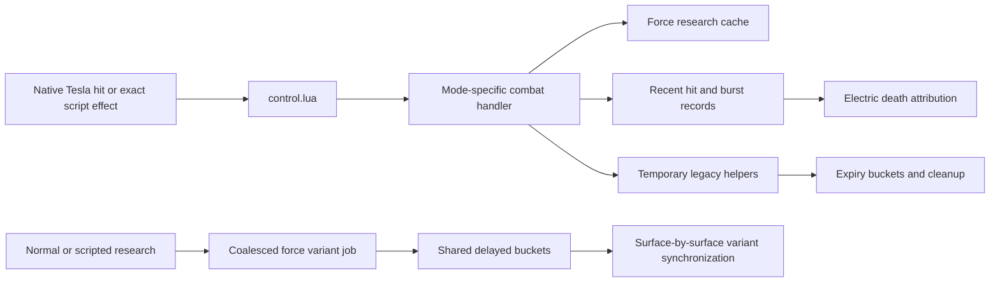

# Tesla combat, research variants, and helper lifetime

## Implementation sources

- [teslas-legacy.lua](../../../exotic-space-industries-remembrance/scripts/control/teslas-legacy.lua)
- [settings.lua](../../../exotic-space-industries-remembrance/teslas_legacy/config/settings.lua)
- [research.lua](../../../exotic-space-industries-remembrance/teslas_legacy/config/research.lua)
- [control.lua](../../../exotic-space-industries-remembrance/teslas_legacy/control.lua)

## Ownership and behavior

The live owner is `scripts/control/teslas-legacy.lua`. The vendored `teslas_legacy/control.lua` deliberately returns an empty table; importing upstream event registrations there would create a second runtime. Startup settings choose `legacy-fidelity` or hybrid behavior. The research catalog supplies indexed legacy coefficients; force caches translate force research into the selected behavior. Native prototypes remain responsible for ordinary acquisition and firing.

`storage.ei.tesla_legacy` owns force caches, recent-hit attribution, burst gates, variant synchronization jobs, and helper-expiry buckets. Legacy `storage.tl_entity_lookup`/`storage.tl_index` remain compatibility state. Exact effect IDs select handlers before state work. The electric-damage hook is active for legacy-fidelity recursion; hybrid deliberately leaves TL-owned global damage handling dormant.

## Tick flow and deadlines

Combat receives `event.tick` and passes it into pruning, hit attribution, burst handling, and helper scheduling. The recent-hit TTL is five ticks, burst gate TTL one tick, and advanced temporary helper cleanup delay 15 ticks. Pruning has its own 600-tick interval. Normal relevant research requests variant synchronization at event tick +1; the coalesced scripted-research receiver accepts `current_tick`. The every-tick dispatcher calls the updater only while synchronization or expiry work exists. Initialization/configuration and explicit status/cleanup surfaces retain eventless fallbacks.

## Lifecycle and invariants

Initialization seeds caches and variants. Configuration refresh clears transient hit/gate/job state, removes stale helpers, and rebuilds caches/variants. `on_load` is intentionally empty. Builds synchronize the placed variant. Aftershocks from replica turrets consume exact unit-number attribution only on electric death; preserve this narrower condition instead of substituting position matches. The standalone cleanup command repairs helpers without creating a polling loop.

## Verification and maintenance

This model is based on current source inspection, not a new engine run. Reuse `scripts/qc/event-tick/README.md` for deliberately distinct supplied ticks, Tesla burst cooldown, and recent-hit expiry boundaries; its recorded result does not validate every Tesla doctrine. Research flood checks use the scripted-research helper documented by `esir-dev`. When changing mode dispatch, validate both behavior modes, duplicate effects, helper expiry, ordinary reload, and research-triggered variant synchronization.
