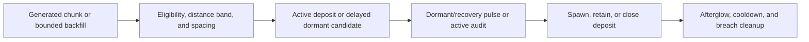

# Vulcanus auric fumarole lifecycle

## Admin repair

`repair_runtime_state` explicitly rebuilds eligibility backfill on all eligible Vulcanus surfaces. Existing active deposits, history and cooldown policy remain owned by the normal rescan implementation.

## Implementation sources

- [vulcanus-fumaroles.lua](../../../exotic-space-industries-remembrance/scripts/control/vulcanus-fumaroles.lua)

## Ownership and reference flow

`storage.ei.vulcanus_fumaroles` owns processed/history/cooldown chunks, generated/active distance-band counts, backfill and dormant queues, active deposits, breach-fire cleanup, and eligibility-version state. Chunk generation and resource depletion are the narrow world-entry events.

## Tick flow and invariants

The dispatcher calls `updater(event)` only through the module's due gate. Backfill, dormant pulses, active audits, and fire cleanup retain separate cadences and budgets; initialization/eligibility probes may wake outside the regular 30-tick boundary. Event ticks feed chunk/depletion work and scheduled processing; bootstrap/status utilities retain context-free reads. Preserve the actual gate precedence when reasoning about simultaneous work.

## Lifecycle and cleanup

Init/configuration bootstrap existing generated chunks without treating them as new world generation. Real mod changes request eligibility refresh even when the runtime sentinel matches. Depletion closes the exact deposit record, records cooldown/history, and schedules presentation cleanup. Dormant candidate and active-deposit indices must remain consistent across closure, expiry, and rebuild; spacing and local saturation constrain spawns.

## Verification contract

The [control UPS fixture](../../../scripts/qc/control-ups/README.md) documents fumarole cadence decision probes. Test fresh chunks, pre-existing explored terrain, absent/reappearing Vulcanus, version refresh, blocked placement, depleted/expired deposits, simultaneous due work, reload, and eventual helper cleanup. Historical gate parity is not a claim about current long-run resource balance.
